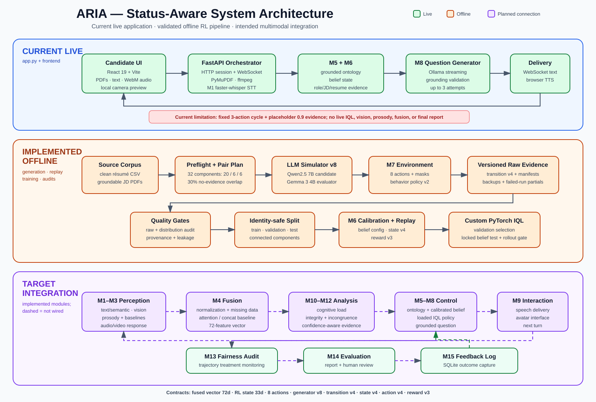
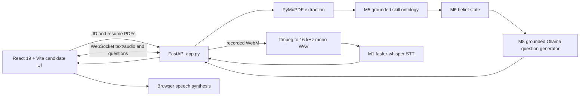
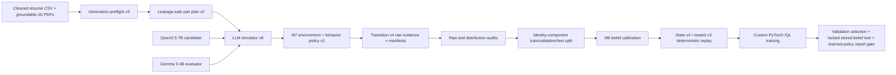
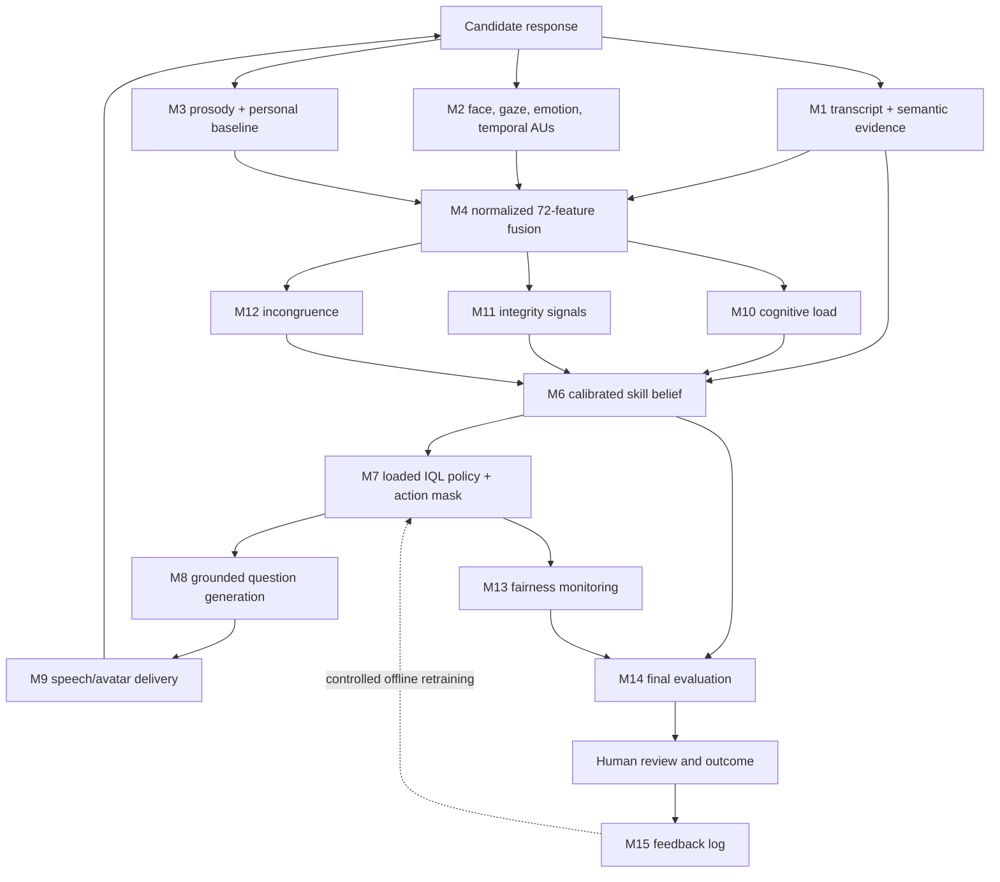

# ARIA — System Architecture

ARIA is a local-first research prototype for adaptive, multimodal technical interviews. This document describes the repository as implemented. It deliberately separates the live application, the offline evidence/training pipeline, and the intended end-to-end multimodal architecture.

## Architecture truth model

| Status | Meaning |
|---|---|
| **Live** | Invoked by `app.py` in the current FastAPI/WebSocket interview path. |
| **Offline** | Implemented and used by dataset generation, calibration, replay, training, or evaluation commands. |
| **Standalone** | Implemented and tested as a module, but not invoked by every live interview turn. |
| **Planned integration** | The intended connection exists architecturally but is not wired into `app.py`. |

This distinction matters: the repository contains implementations for all 15 module areas, but the live web application does not yet execute the complete multimodal or learned-policy loop.

## 1. Current live application

The current live path provides:

- multipart session creation with résumé and job-description PDFs;
- grounded role-profile and ontology construction;
- typed or recorded answers over a WebSocket;
- `ffmpeg` conversion and faster-whisper transcription for recorded audio;
- grounded, retry-validated question generation through Ollama;
- browser speech synthesis and a local camera preview.

Current live limitations are explicit:

- the camera preview is not processed by Module 2;
- Modules 2–4 and 10–13 are not orchestrated per live turn;
- belief updates use placeholder semantic/behavior scores of `0.9` and cognitive load `low`;
- actions follow a fixed three-action cycle, not a loaded IQL policy;
- Module 9 server-side TTS is instantiated but its call is disabled; the browser performs speech synthesis;
- Modules 14 and 15 are not exposed through the live API.

## 2. Offline evidence and RL pipeline

### Generation controls

- Candidate and evaluator models are distinct by contract. Defaults are `qwen2.5:7b` and `gemma3:4b`.
- The preflight verifies unique resumes, readable/nonduplicate JDs, grounded role profiles, identity-component capacity, and pairing-mix feasibility.
- Pair planning creates disconnected résumé/JD components for leakage-safe downstream splitting. The production default is 32 components allocated `20/6/6`.
- The planned no-evidence-overlap target is `0.30`, with a production target band of `0.25–0.35`.
- Pair class is computed with the same evidence matcher used by grounded role profiles and is verified again during generation.
- Raw transitions, run manifests, backups, and failed-run partial artifacts are versioned and hash-addressed.

### Behavior and termination controls

The environment exposes eight actions:

1. `increase_difficulty`
2. `decrease_difficulty`
3. `ask_follow_up_same_topic`
4. `switch_topic`
5. `probe_foundation`
6. `ask_behavioral`
7. `ask_situational`
8. `conclude_interview`

`conclude_interview` is masked until all three requirements are satisfied:

- at least 10 question turns;
- at least five visited skills, capped by the ontology size;
- at least five valid evidence updates.

Generation uses a state-conditioned stochastic behavior policy. It prioritizes untouched skills while coverage is incomplete, enters coverage recovery at turn 20, and forces a conclusion at turn 25 only when conclusion is legal. A hard truncation remains at turn 30. Conclusion readiness and blockers are logged before and after each action.

### Current generation quality targets

| Metric | Production target | Hard acceptance range |
|---|---:|---:|
| `switch_topic` share of question actions | 25–35% | ≤40% |
| maximum-turn termination rate | ≤10% | ≤15% |
| no-evidence-overlap episode rate | 25–35% | 20–40% |

The gates activate for complete current-schema corpora with at least 60 terminal episodes and report strata by persona, derived dataset split, and ontology-size band.

## 3. Module map and integration status

| Module | Repository implementation | Current status |
|---|---|---|
| 1 — STT and semantic grading | `modules/module_01_stt/transcriber.py`, `semantic_grader.py` | STT live; semantic grader standalone |
| 2 — Vision | `modules/module_02_vision/` | Standalone; camera is preview-only in live UI |
| 3 — Prosody | `modules/module_03_prosody/` | Standalone |
| 4 — Multimodal fusion | `modules/module_04_fusion/` | Standalone; canonical 72-feature contract |
| 5 — Skill ontology and grounding | `modules/module_05_ontology/graph.py`, `grounding.py` | Live and offline |
| 6 — Competency belief | `modules/module_06_belief/belief_state.py`, `belief_config.py` | Live with placeholder evidence; calibrated offline path implemented |
| 7 — RL interview policy | `modules/module_07_rl/` | Environment, generation, audits, replay, and training implemented offline; learned checkpoint not live |
| 8 — LLM question generation | `modules/module_08_llm/generator.py` | Live and offline through Ollama |
| 9 — TTS/avatar | `modules/module_09_tts/engine.py` | `pyttsx3` prototype; avatar placeholder; browser TTS is live |
| 10 — Cognitive load | `modules/module_10_cognitive_load/classifier.py` | Standalone rule-based four-state classifier |
| 11 — Anti-gaming | `modules/module_11_anti_gaming/` | Standalone gaze, latency, and semantic detectors |
| 12 — Incongruence | `modules/module_12_incongruence/detector.py` | Standalone rule-based semantic/prosody delta detector |
| 13 — Fairness | `modules/module_13_fairness/auditor.py` | Standalone session audit service |
| 14 — Evaluation | `modules/module_14_evaluation/report.py` | Standalone structured report and Ollama narrative service |
| 15 — Feedback | `modules/module_15_feedback/logger.py` | Standalone SQLite trajectory/outcome logger; no automatic retraining trigger |

## 4. Intended full multimodal turn loop

This is the target integration topology, not a claim that every arrow currently executes in `app.py`. Human review remains mandatory before using outputs in consequential hiring decisions.

## 5. Data contracts

### Multimodal representation

`modules/module_04_fusion/schema.py` defines the canonical 72-dimensional vector:

| Modality | Index range | Dimensions | Contents |
|---|---:|---:|---|
| Text/semantic | `[0:11]` | 11 | 4 STT features, 4 semantic scalars, 3 competency probabilities |
| Vision | `[11:44]` | 33 | 5 confidence/scalar features, 5 emotion probabilities, 2 gaze, 3 head pose, 9 AU activations, 9 AU deviations |
| Prosody | `[44:72]` | 28 | 12 acoustic scalars, 3 baseline deviations, 13 MFCCs |

WavLM embeddings may be extracted by Module 3, but they are not inserted directly into the fixed 72-dimensional contract.

### RL representation

`modules/module_07_rl/state_builder.py` defines a permutation-invariant 33-dimensional `aria-state-v4` vector. It contains aggregate and focused-skill beliefs, normalized entropies, coverage/turn/evidence fractions, previous evidence and cognitive signals, the previous eight-action one-hot vector, and modality-availability flags. The action mask is stored separately.

Current versioned contracts are:

| Contract | Version |
|---|---|
| Generator | `aria-simulator-v8` |
| Behavior policy | `aria-behavior-policy-v2` |
| Pair plan | `aria-pair-plan-v2` |
| Transition | `aria-transition-v4` |
| State | `aria-state-v4` |
| Action | `aria-action-v4` |
| Reward | `aria-reward-v3` |

## 6. Deployment and hardware boundary

- The supported development target is Windows with a Python virtual environment, Node/Vite, `ffmpeg`, and Ollama.
- CUDA is optional for selected modules but required for practical performance of the full perception stack.
- Large models are loaded lazily where implemented. On an 8 GB GPU, concurrent residency of every perception and language model is not assumed.
- Offline generation explicitly bounds candidate and evaluator request concurrency and reports Ollama model capacity.
- Exact VRAM consumption depends on model quantization, context length, driver/runtime versions, and which standalone modules are active; fixed per-module VRAM allocations are therefore not part of the architecture contract.

## 7. Integration priorities

1. Replace live placeholder scores with Module 1 semantic evidence and calibrated confidence.
2. Implement fresh learned-policy rollout evaluation; the current locked-test command evaluates stored belief verdicts, while the learned-policy audit consumes a supplied rollout report.
3. Load the selected IQL checkpoint in the live orchestrator and enforce the same state/action-mask contracts as replay.
4. Stream or batch camera frames and audio features through Modules 2–4.
5. Feed Modules 10–12 into belief/state construction and Module 13 into continuous audit logging.
6. Add explicit interview conclusion, Module 14 report generation, human review, and Module 15 outcome capture.
7. Add privacy, retention, accessibility, fairness, adversarial, and human-oversight validation before deployment beyond research use.
