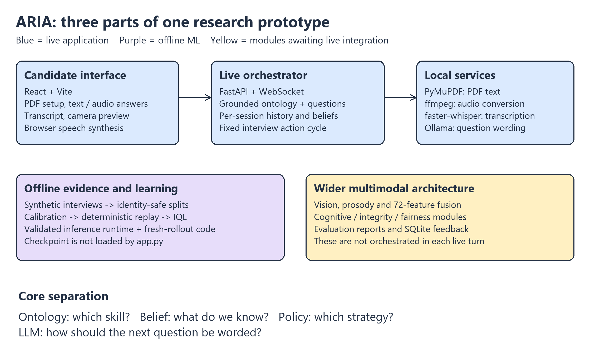
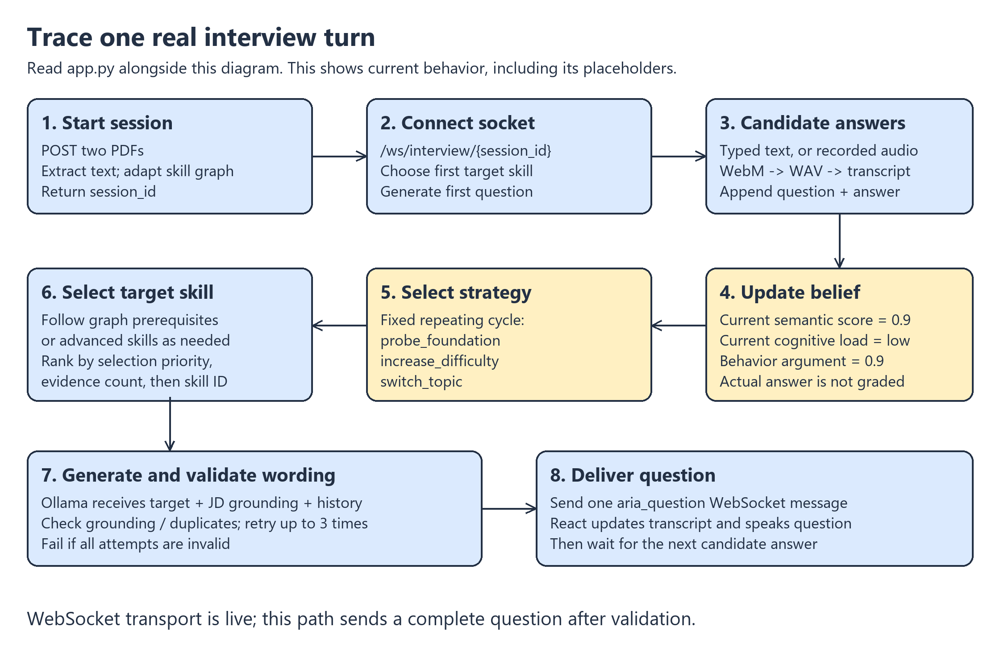
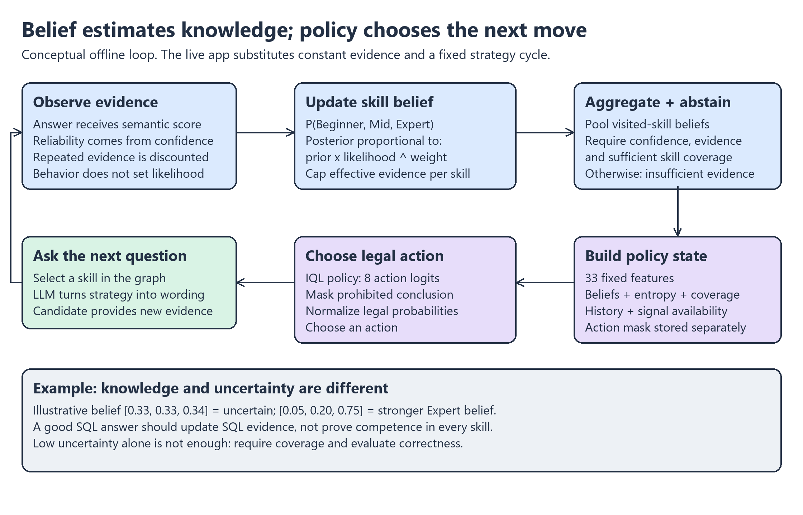
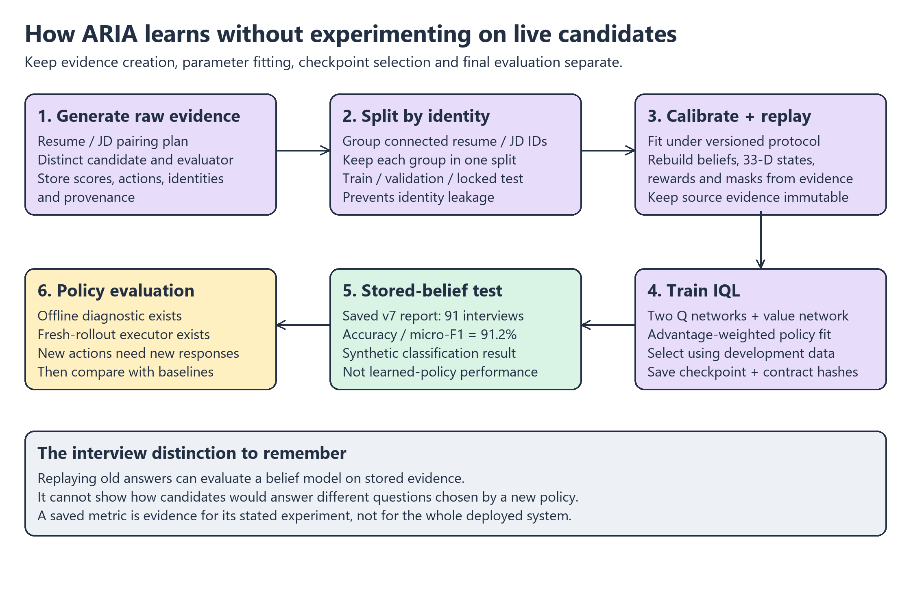

# ARIA: software engineering interview study guide

Prepared from the local implementation on 25 September 2026. Code and saved artifacts take priority over older README descriptions. This is a study guide, not a new benchmark or a claim that the application was run successfully.

## 1. Your 60-second explanation

“ARIA stands for Autonomous Reinforcement-Based Interview Agent. It is a local-first research prototype for adaptive technical interviews. It builds a skill graph from the job description and candidate résumé, maintains a probability distribution over competency for each skill, and separates interview strategy from question wording. The intended learned policy decides whether to probe, follow up, change difficulty, switch topics, or conclude; a local LLM formulates a grounded question.

“The implemented web application uses React, FastAPI and WebSockets, with local speech transcription and Ollama question generation. The offline pipeline handles evidence generation, calibration, replay and IQL training. The current live loop still has placeholder semantic scores and a fixed action cycle, so integrating calibrated scoring and the learned policy is the next engineering milestone.”

Only say “I implemented” for work you personally did. Be ready to distinguish your contribution from your teammates’ work.

## 2. Understand the four responsibilities

| Component | Question it answers | Example |
|---|---|---|
| Ontology | Which skills and prerequisite relationships matter? | Transactions build on database foundations. |
| Belief model | What does the accumulated evidence suggest? | SQL: probabilities over Beginner, Mid, Expert. |
| Interview policy | What strategy should the next turn use? | Probe a foundation or switch to a less explored skill. |
| Question generator | How should that strategy be expressed? | Generate a question supported by the target skill and JD. |

This separation gives each component a smaller contract. You can test action selection without judging prose, change the language model without redefining the action space, and inspect skill evidence without parsing the entire conversation again. It also creates integration work: the state and evidence contracts must agree across the live app and offline training.

An illustrative database interview: the ontology identifies SQL and transactions; an answer supplies SQL evidence; the belief distribution changes; a policy may choose `increase_difficulty`; graph traversal selects a suitable advanced skill; the LLM writes its question. This illustrates the intended loop. The current live strategy choice is a fixed cycle.

## 3. Trace the actual live application

Read `app.py` and `frontend/src/components/InterviewScreen.jsx` while explaining this aloud.

1. **Setup:** React sends résumé and JD PDFs as multipart form data to `POST /api/start-session`, with a role name.
2. **Extraction:** the backend reads the bytes and uses PyMuPDF to extract text. Extraction is offloaded with `asyncio.to_thread`. Empty extraction causes HTTP 400.
3. **Grounding:** `SkillOntologyGraph.adapt_to_candidate` builds and validates a role profile. Failure to build a grounded profile causes HTTP 422.
4. **Session:** a UUID keys an in-memory dictionary containing ontology, belief updater, history, résumé, JD, current target and turn count. The response contains the session ID and role metadata.
5. **Connection:** React opens `/ws/interview/{session_id}`. The backend verifies the session and question generator, then generates an initial `switch_topic` question.
6. **Answer:** a typed answer arrives as `candidate_answer`. A recorded answer arrives as `candidate_audio` containing base64 WebM; ffmpeg converts it to 16 kHz mono WAV, then faster-whisper transcribes it. The transcript is sent back to the client.
7. **State mutation:** append the question and answer to history. The current code updates the target skill with `semantic_score=0.9`, `cognitive_load="low"`, and `behavior_score=0.9`. The belief implementation ignores the behavior argument. Consequently the live update does not yet reflect answer quality.
8. **Strategy:** cycle through `probe_foundation`, `increase_difficulty`, `switch_topic`. Importing `ARIAInterviewEnv` does not mean an RL policy is executing: no learned checkpoint is loaded in this path.
9. **Target:** use prerequisites for foundation/easier actions and successors for increasing difficulty. Otherwise retain or change the skill according to the action. Rank candidates by `selection_priority`, evidence count and skill ID.
10. **Question:** pass action, beliefs, target, grounding context, résumé and history to the generator. Normalize and validate the result; retry at most three times with correction feedback. Exhaustion raises an error.
11. **Delivery:** send a complete `aria_question` message. React updates its transcript and uses browser speech synthesis. On disconnect, the backend removes the session.

**Precise streaming answer:** WebSocket communication is persistent, but the current live orchestrator waits for a complete, validated question before sending it. The frontend has an `aria_chunk` branch, and generation capabilities exist elsewhere, but that does not establish token streaming in this path. Recorded audio is uploaded after recording stops; this is not continuous streaming ASR.

**Why WebSockets?** They support repeated bidirectional turn messages without repeatedly establishing a request flow. Ordinary HTTP could also implement this turn-based prototype. WebSockets are a design choice, not a requirement of interviewing; they introduce connection lifecycle, recovery and backpressure concerns.

## 4. The skill graph is a useful data structure

`modules/module_05_ontology/graph.py` uses a node set and two adjacency maps: successors for more advanced skills and predecessors for prerequisites. Cycle validation protects the prerequisite structure.

For an illustrative `SQL basics -> transactions -> isolation` chain, probing a foundation from transactions can retrieve SQL basics, while increasing difficulty can retrieve isolation. Direct neighbor lookup is efficient with adjacency maps; iterating neighbors costs proportional to the number retrieved. Graph validation by DFS is O(V + E). Target selection with `min` is O(k) over its candidate set.

Grounding associates skills with JD support and metadata. In `grounding.py`, question validation includes excessive length, duplicates, missing lexical support and certain domain/acronym problems. These are useful checks, but lexical support does not prove semantic correctness. A plausible but incorrect question may still pass.

**Why not a flat list?** A list supports coverage, but does not encode how to move from an advanced topic to its foundations. **Why not let the LLM choose everything?** Explicit graph and action contracts make coverage, testing, reproducibility and auditing easier. The tradeoff is extra modeling and validation complexity.

## 5. Belief tracking without intimidating mathematics

For each skill, ARIA stores three probabilities: Beginner, Mid and Expert. A belief such as `[0.33, 0.33, 0.34]` expresses uncertainty; `[0.05, 0.20, 0.75]` expresses stronger evidence for Expert. These are illustrative values, not measured outputs from a particular interview.

The updater uses a Gaussian-shaped likelihood of the semantic score under each competency class. In simplified notation:

`new_belief[class] ∝ old_belief[class] × likelihood(score | class)^weight`

The implementation computes this in log space and normalizes with softmax, then applies a small posterior floor. Class centers and scales come from the belief configuration. This is evidence accumulation over assumed competency classes, not proof that a candidate learned a skill during the conversation.

The evidence weight multiplies evaluator, transcription and modality confidence, discounts repeated effective evidence, optionally discounts repeated question fingerprints, and caps per-skill effective sample size. Ten nearly identical answers should not count like ten independent experiments. Fingerprint discounting only applies when callers supply fingerprints; the live placeholder update does not.

**Important implementation boundary:** `behavior_score` does not affect the competency likelihood. Cognitive load is validated as an input but is not used to change this likelihood in the current updater. Behavioral and cognitive signals can instead inform strategy/context. Do not explain ARIA as directly equating nervousness, gaze or facial affect with low competence.

Across skills, the implementation combines visited-skill evidence with a normalized log-opinion pool, weighted by importance and capped effective evidence. It checks confidence, coverage and total effective evidence before issuing a class; otherwise it returns insufficient evidence. Belief-v3 also supports an explicitly configured low-class decision bias. The live app constructs the default updater rather than loading the calibrated v7 belief configuration.

**Entropy:** measures how spread out the probabilities are. Lower entropy means greater certainty, not necessarily greater accuracy. A wrongly calibrated system can be confidently wrong. Coverage gates and evaluation are needed alongside uncertainty reduction.

**Why a POMDP?** Competence is hidden; answers are imperfect observations. Questions influence which observations arrive next. The practical policy uses a compact belief/history summary rather than seeing true competence. That is an approximation to the full partially observed decision problem.

## 6. Understand the offline pipeline

There are two different feature representations. The standalone multimodal fusion contract has **72 dimensions**: 11 text/semantic, 33 vision and 28 prosody. The current policy input in `state_builder.py` is **33 dimensions**, `aria-state-v4`. Do not repeat the older README's 32-dimensional state claim.

The policy state includes aggregate and focused-skill beliefs, uncertainty, skill coverage, turn/evidence fractions, previous signals, previous action one-hot and availability flags. Aggregating skill information keeps its size independent of the number and ordering of ontology nodes. The cost is information loss compared with a full graph representation. The eight-element legality mask is stored separately.

The actions are increase difficulty, decrease difficulty, follow up on the same topic, switch topic, probe foundation, ask behavioral, ask situational and conclude. The environment restricts conclusion using question-turn, visited-skill and valid-evidence requirements; inspect `conclusion_status` for the canonical rules. It requires 10 question turns, five valid evidence updates, and skill coverage equal to the greater of five and the configured minimum, capped by ontology size. It also masks same-topic follow-up when there is no previous target. These constraints belong to the RL environment, not the current live action cycle.

### Why offline RL and IQL?

Offline training learns from recorded transitions instead of trying arbitrary policies on live candidates. ARIA's IQL implementation has two Q networks, a value network and a policy network. Q estimates expected future return for a state-action pair; value estimates a state value; their difference is an advantage. The value fit uses expectile regression, the Q networks use a temporal-difference target, and the policy learns recorded actions with larger weights for higher advantages. The code caps exponential weights and clips gradients.

For a software interview, say: “IQL gives us a way to improve action selection using an offline dataset, but it is constrained by the quality and action coverage of that dataset.” It does not solve synthetic-data bias or make unsupported actions reliable by itself.

The step reward combines nonnegative information gain and first-skill coverage bonuses with turn cost, redundancy, distress and invalid-action penalties. Terminal outcome shaping rewards correct classification and penalizes errors/abstention, once per terminal transition. The canonical formula is in `reward_model.py`; not every constant in `rl_spec.py` is used in the current step formula. True labels can shape offline rewards but must not enter the policy's runtime observation.

### Why immutable evidence and identity splits?

If calibration changes, regenerate beliefs, states, rewards and masks from the same raw observations. Otherwise a dataset can silently combine old and new semantics. Version names and content hashes make mismatches detectable.

Randomly splitting turns leaks an interview across sets. Splitting episodes alone can still share résumé or JD identities. ARIA groups connected résumé/JD identities and isolates those groups across train/development/test. Fit and select under the applicable versioned calibration protocol, freeze the artifacts, then perform the locked evaluation. This guards against leakage and repeated test-set tuning; it does not by itself establish real-world validity.

`iql_policy.py` validates checkpoint schemas, state feature order, model architecture and provenance before inference. It verifies finite observations and binary masks, excludes illegal actions, and defaults to deterministic selection. Fresh-rollout execution is implemented in `learned_policy_rollout.py`; older architecture prose saying it still needs implementation is stale. Its existence does not demonstrate that a particular checkpoint passed fresh-rollout evaluation.

## 7. What you can accurately say about results

The saved v7 report at `data/synthetic/v3/production-grounding-v10/derived-calibration-v7/release/locked_test_evaluation_v1.json` records:

| Quantity | Saved result |
|---|---:|
| Synthetic test examples | 91 |
| Identity components | 6 |
| Accuracy / micro-F1 | 0.9121 |
| Macro-F1 | 0.9168 |
| Balanced accuracy | 0.9227 |
| Abstention rate | 0 |
| `evaluates_learned_policy` | false |

Interview wording: “Our saved v7 locked synthetic test report shows 91.2% competency-classification accuracy on 91 examples. That evaluates the belief pipeline on stored evidence. It does not establish learned-policy benefit or performance on human interviews.” This guide inspected the report; it did not rerun or independently reproduce the experiment.

The adjacent offline policy evaluation report is a clipped weighted-importance-sampling diagnostic on validation transitions. It explicitly has `release_gate=false` and requires fresh rollouts for causal claims. Do not present its weighted reward as an accuracy figure or as proof of superiority.

Why fresh rollouts? A new policy asks different questions. The stored answer to an old question is not the candidate's answer to the new question. Policy evaluation therefore needs new policy-driven trajectories and suitable baseline comparisons. For synthetic rollouts, conclusions still concern that simulator unless independently validated on humans.

## 8. Strong engineering follow-up answers

| Likely question | Concrete answer grounded in ARIA |
|---|---|
| How would you scale sessions? | The global dictionary is process-local and disappears on restart/disconnect. Introduce durable session records and shared storage, define concurrency ownership, and keep heavyweight model workers separate from API workers. |
| Is `async def` enough for scalability? | No. It only helps when operations yield. PDF extraction uses a thread; ffmpeg uses an async subprocess; ontology adaptation is called synchronously from the async route and must be inspected/offloaded if blocking. GPU inference also needs bounded scheduling. |
| Where is latency spent? | Audio upload/conversion, transcription, question generation and validation retries. Instrument each stage before optimizing. Local inference removes cloud network dependence but does not make model execution cheap. |
| What if Ollama produces bad output? | The current path validates and retries up to three times. Exhaustion raises an exception and closes the socket. A production design would provide a structured recoverable error or a validated fallback question. |
| What if the connection drops? | The current backend removes the session. Add an explicit lifecycle, persistence and reconnect protocol if resumption is required. Turn IDs and idempotency keys help avoid duplicate updates. |
| Why retain raw evidence? | It permits reproducible replay when calibration changes and an audit trail for derived state and rewards. Retention of personal data still needs explicit product rules. |
| What is the test strategy? | Unit-test graph traversal, belief normalization, invalid evidence and action masks; contract-test replay/checkpoint compatibility; integration-test setup and text/audio turns using stubbed models; reserve slower model smoke tests for a controlled environment. |
| What should be integrated first? | Real semantic evidence and the calibrated config, then the validated policy using exactly the training state/mask contract; then explicit stopping/reporting, followed by additional modalities. |
| Why local-first? | It supports local control of interview data and models. The cost is GPU memory, installation, model availability and throughput management. Local-first alone does not establish privacy or production security. |

The current code also merits focused hardening around input-size limits, ffmpeg return-code checks, guaranteed temporary-file cleanup, request authentication, cancellation and concurrent access to a session. These are engineering observations from reading the path, not a completed security audit.

## 9. What to read tonight, in order

Use a three-hour plan; if you have less time, prioritize the first four rows.

| Time | Activity | Check you can answer aloud |
|---|---|---|
| 15 minutes | System map + 60-second pitch | What problem is ARIA solving? What runs live? |
| 35 minutes | `app.py`, setup and interview React components | Trace setup and one typed/audio answer end to end. |
| 25 minutes | `graph.py`, grounding and question generation | Why a graph? How is a target selected and wording validated? |
| 25 minutes | `belief_state.py`, configuration | Why probabilities? How does reliability change an update? |
| 25 minutes | State builder, environment, reward, IQL train/runtime | What are state, action, reward and legality? |
| 15 minutes | Saved v7 test and policy diagnostic | What does 91.2% measure, and what does it not establish? |
| 25 minutes | Engineering tradeoffs | How would you add persistence, recovery and inference workers? |
| 15 minutes | Closed-book explanation | Draw the system and trace one turn without notes. |

Practice these five prompts: (1) Explain ARIA in one minute. (2) Follow an audio answer from the browser to the next question. (3) Distinguish ontology, belief, policy and LLM. (4) Explain one failure mode and your fix. (5) State your measured result with its experimental boundary.

## 10. Excalidraw files

Open the `.excalidraw` files in Excalidraw using its Open command or drag-and-drop. Each contains editable shapes, text and arrows. Matching PNGs are quick previews generated from the same diagram definitions; Excalidraw renders its own hand-drawn styling.

- `01-system-map.excalidraw`
- `02-live-turn.excalidraw`
- `03-belief-and-policy.excalidraw`
- `04-offline-pipeline.excalidraw`

No application source or benchmark artifacts were modified to prepare this guide.
