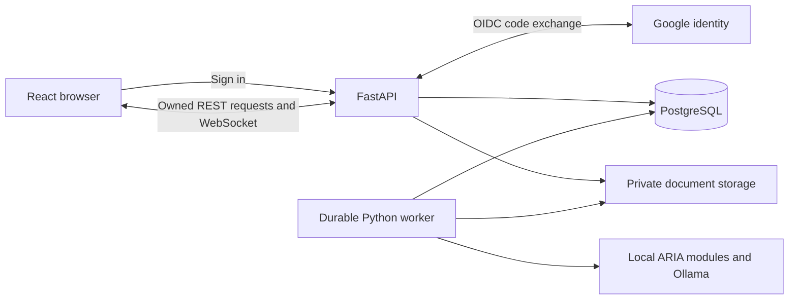
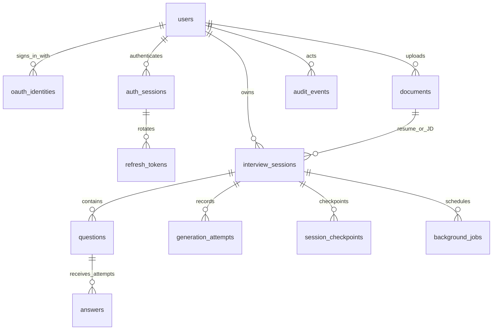

# ARIA specification 001: Authentication and durable interview ownership

| Field | Value |
|---|---|
| Status | **APPROVED — implementation authorized** |
| Version | 1.0 |
| Prepared | 2026-10-08 |
| Decision owner | Raghav Sejpal |
| Scope | Google login, ARIA JWT sessions, private document uploads, owned interviews, durable questions and answers |
| Confirmed preferences | Google only initially; local development first, hosted pilot later; PostgreSQL preferred |
| Approval record | Approved by Raghav Sejpal on 2026-10-08 by instruction to implement this specification |

## 1. Purpose and specification workflow

ARIA must reliably identify who uploaded each résumé and job description, requested each interview, received each question, and submitted each answer. The initial release must support private interview history that survives browser refreshes and backend restarts.

This document is the approved implementation contract. **MUST** identifies required behavior; **SHOULD** identifies a recommendation whose exception must be documented. Numeric limits and architecture choices in this version are approved defaults unless a later amendment changes them.

Workflow:

1. Review this document, including the decision register in section 12.
2. Resolve or explicitly defer open decisions; revise the draft.
3. Record the approved version, date, approver, and resolved choices in this file.
4. Create implementation tasks mapped to requirement and acceptance IDs.
5. Implement in the dependency order in section 11. Each completed change must identify its requirements and verification evidence.
6. Change approved behavior through a spec amendment before changing the implementation. Record data migration, API compatibility, and test impacts.

No application code, dependencies, migrations, provider accounts, or databases are created by this draft. Schema descriptions below are design contracts, not an applied migration.

## 2. Verified baseline and scope

### 2.1 Repository baseline

Reviewed on 2026-10-08:

| Area | Current behavior | Required change |
|---|---|---|
| `app.py` | `POST /api/start-session` accepts two PDFs without authentication | Authenticate before accepting uploads; persist ownership and session inputs |
| Session lifecycle | Global `sessions` dictionary; deleted in the WebSocket `finally` block | Database is authoritative; disconnect releases resources without deleting history |
| Questions | Draft chunks followed by a grounded `aria_question`; up to three grounding attempts | Persist the accepted final question before its authoritative event; record attempt outcomes |
| Answers | Typed text or temporary WebM transcription; Q/A history exists in memory | Persist answers, modality, provenance, and acknowledgement IDs |
| Frontend | React 19 / Vite 8; setup and interview screens; hardcoded localhost URLs | Add login, history, session reload, authenticated requests, and configurable routing |
| End interview | Frontend returns to setup; no durable completion API | Explicit backend completion transition |
| Module 15 | Standalone SQLite logger records trajectories and feedback; not connected to live ownership | Keep offline data separate; establish PostgreSQL as the live account/history store |
| Live scoring/policy | Placeholder evidence and fixed action cycle | Record truthful implementation provenance; this specification does not fix or validate scoring |
| Dependencies | FastAPI, HTTPX, PDF extraction and STT present; no live ORM/auth layer | Add the approved auth and persistence dependencies |

Source files: [`app.py`](../../app.py), [`frontend/package.json`](../../frontend/package.json), [`App.jsx`](../../frontend/src/App.jsx), [`SetupScreen.jsx`](../../frontend/src/components/SetupScreen.jsx), [`InterviewScreen.jsx`](../../frontend/src/components/InterviewScreen.jsx), [`logger.py`](../../modules/module_15_feedback/logger.py), and [`test_live_interview_transport.py`](../../tests/test_live_interview_transport.py).

### 2.2 Included in the first implementation

- Google sign-in/sign-out and secure ARIA access/refresh sessions.
- One private account per Google identity; access only to that account's resources.
- Upload one résumé PDF and one JD PDF for an interview; reuse the user's existing uploads in later interviews.
- Exact, immutable input references per interview; replacement creates a new document.
- Persist accepted questions and typed answers or speech transcripts, with ordering and provenance.
- View, resume, complete, cancel, and delete owned interviews.
- Recover durable state after disconnect/restart; handle generation, transcription, storage, and database failures visibly.
- Private document access, explicit retention and deletion, and operational audit metadata.
- Migrations and focused security, database, transport, and browser acceptance coverage.

### 2.3 Deferred work

Additional providers, passwords, account linking, coach access, organization tenancy, interview sharing, raw audio/video archives, DOCX/OCR, semantic/vector search, training exports, retraining, new scoring, and integration of final analytical reports require separate approved scope. The first release's history page is an accurate transcript and session summary; it must not present placeholder scores as a completed assessment.

## 3. Technology choices and hosting recommendation

### 3.1 Proposed stack

| Layer | Choice | Reason / boundary |
|---|---|---|
| UI | Existing React 19 + Vite 8; JavaScript/JSX | Extend existing screens and add account/history views |
| API / transport | Existing FastAPI + Pydantic contracts + WebSockets | Backend remains responsible for ownership and authoritative interview state |
| Login | Google OpenID Connect, OAuth authorization code flow with PKCE S256 | Google verifies identity; request only `openid email profile` |
| OAuth library | Authlib 1.x with HTTPX | Use supported protocol validation and fixed Google discovery metadata |
| ARIA tokens | PyJWT 2.x with `cryptography`; RS256 access JWTs; opaque refresh tokens | ARIA controls session lifetime, rotation, and revocation |
| Database | PostgreSQL 17, latest tested patch in that major | Transactions, foreign keys, unique constraints, JSONB, portable hosting |
| ORM / driver | SQLAlchemy 2.x asyncio + Psycopg 3 (`postgresql+psycopg`) | Typed models and short async transactions |
| Migrations | Alembic 1.x, separate migration role | Versioned, reviewed schema changes; no runtime `create_all` |
| Development DB | Docker Compose PostgreSQL with a named volume | Reproducible local development; native PostgreSQL 17 is an acceptable Windows alternative |
| Document storage | Private local filesystem behind a storage interface | Files stay local initially; DB stores metadata and extracted text |
| Hosted storage | Private S3-compatible object storage, selected before pilot | File bytes are separate from the hosted PostgreSQL service |
| Durable work | PostgreSQL job table and a separately runnable Python worker | Recover document processing and question generation without introducing Redis initially |
| Verification | pytest, FastAPI/HTTPX tests, real test PostgreSQL; Playwright browser tests | Validate actual constraints and multi-user flows; SQLite is not a substitute for DB tests |

Retain the repository's working Python/ML environment. During implementation, resolve and lock compatible patch versions and the database image digest; do not upgrade unrelated ML dependencies. Authlib supports async web clients; SQLAlchemy supports the Psycopg 3 dialect and asyncio; Alembic manages migrations. [Authlib](https://docs.authlib.org/en/stable/oauth2/client/web/index.html), [SQLAlchemy PostgreSQL](https://docs.sqlalchemy.org/en/20/dialects/postgresql.html), [SQLAlchemy asyncio](https://docs.sqlalchemy.org/en/20/orm/extensions/asyncio.html), [Alembic](https://alembic.sqlalchemy.org/en/latest/).

### 3.2 Local PostgreSQL versus Neon and alternatives

**Recommendation: use local PostgreSQL now, retain the same schema and migration path for a later Neon pilot.** Local development matches the user's stated rollout and the repository's local processing preference. PostgreSQL fits the ownership and relational history requirements; another database type offers no clear benefit for this scope.

| Option | Advantages for ARIA | Tradeoffs | Proposed use |
|---|---|---|---|
| Local PostgreSQL | Local candidate data, offline DB access, reproducible tests, no service bill | Team sharing, backups, and availability are our responsibility | Default for development and CI |
| Neon PostgreSQL | Managed PostgreSQL with pooling and compute suspension | Network dependency, wake-up behavior, plan limits, and a separate private file store | Preferred candidate for hosted pilot |
| Supabase | PostgreSQL, managed Auth, and Storage in one platform | Adopting Supabase Auth changes token/session ownership and this schema; avoid maintaining two auth systems | Alternative if we decide a managed auth/storage bundle is preferable |
| Render Postgres | Managed database near a Render-hosted API; recovery features on eligible plans | Hosting/plan selection and backup coverage need review | Consider if the API will run on Render |

Neon offers PgBouncer transaction pooling and scale to zero. Background polling can prevent idle suspension, so a database worker must use idle backoff and the hosted budget must account for its workload. Do not assume a free plan is suitable for real candidate data or always-on workloads. [Neon pooling](https://neon.com/blog/postgres-support-case-recap), [Neon compute behavior](https://neon.com/docs/manage/endpoints/).

Supabase offers a full PostgreSQL database, social authentication, and file storage; it is a viable alternative stack, not an additional authentication layer to bolt onto the proposed ARIA issuer. Render documents recovery and backup options separately. [Supabase features](https://supabase.com/features), [Render backups](https://render.com/docs/postgresql-backups).

The hosted decision must compare the selected region, API-to-database latency, storage and egress costs, connection limits, suspension settings, backup retention and restoration, and monthly budget. Pricing is intentionally not frozen into this spec. Hosting real candidate data externally requires the explicit deployment/data-location decision described in the repository guidance. Google login itself is external identity processing; résumé, JD, and answer contents must never be sent to Google for login.

### 3.3 Runtime boundaries

Production should serve UI, `/api`, and `/ws` behind one HTTPS origin. Development should use the Vite proxy for `/api` and `/ws` and one consistent hostname. The browser never connects directly to PostgreSQL. A local filesystem is suitable for one machine; multiple hosts require shared private object storage before deployment.

## 4. Feature requirements

| ID | Requirement |
|---|---|
| AUTH-01 | A visitor MUST sign in with Google before uploading, creating, reading, or modifying interview resources. Successful repeat login MUST resolve to the same internal user. |
| AUTH-02 | The backend MUST validate OAuth state, PKCE, nonce, Google signature/issuer/audience/expiry and verified email before issuing ARIA credentials. |
| AUTH-03 | ARIA MUST issue short-lived access JWTs and rotating refresh tokens, with current-device and all-device logout. |
| AUTH-04 | Every resource operation MUST derive identity from verified credentials, enforce ownership, and reject forged client ownership fields. |
| AUTH-05 | HTTP writes MUST enforce CSRF protection; WebSockets MUST validate origin, authentication, ownership, expiry, and revocation. |
| DOC-01 | A user MUST be able to upload private PDF documents as `resume` or `job_description`, inspect processing status, and download their own originals. |
| DOC-02 | Starting an interview MUST require exactly one ready résumé and one ready JD belonging to the same owner. |
| DOC-03 | Document contents and extraction results MUST be immutable once ready. Replacement creates a new ID; historical interviews retain their original references. |
| DOC-04 | Upload validation, processing failures, orphan cleanup, retention, and deletion MUST have visible, retryable outcomes. |
| INT-01 | An interview MUST have a durable owner, lifecycle, immutable input pair, role snapshot, and implementation provenance. |
| INT-02 | The exact accepted final question MUST be committed before it is presented as authoritative; draft chunks MUST be visibly provisional. |
| INT-03 | Each answer MUST identify its question and owner, preserve accepted text and modality, and be acknowledged only after durable acceptance. |
| INT-04 | Retries and concurrent submissions MUST not create duplicate accepted answers, questions, or state updates. |
| INT-05 | Disconnect and backend restart MUST preserve committed history; compatible saved state MUST allow resumption without rerunning already committed turns. |
| INT-06 | LLM/STT failures MUST not erase an accepted answer, invent a result, or count missing audio as poor performance. |
| INT-07 | Complete/cancel MUST be explicit server transitions; terminal sessions MUST reject new answers and generation results. |
| UI-01 | Provide sign-in, account/logout, authenticated setup, paginated history, session details, resume, complete/cancel, and delete flows. |
| UI-02 | Display upload status, unsaved/pending/accepted answers, draft/final questions, reconnect state, and actionable errors. |
| DATA-01 | Store consent version and timestamps; provide deletion with immediate access removal and eventual physical purge. |
| DATA-02 | Logs and audit events MUST exclude document contents, answer text, credentials, and raw provider responses. |
| OPS-01 | Use versioned migrations, bounded connection pools, durable jobs, private storage, and tested restore procedures. |
| OPS-02 | Record provenance honestly and keep live candidate data separate from offline training/evaluation data. |

## 5. Authentication and authorization contract

### 5.1 Google login

OAuth authorizes a code exchange; OpenID Connect supplies the validated identity. ARIA's JWT is then its own API credential. Google tokens must not be accepted as ARIA API tokens. Google's OIDC documentation specifies discovery and identity claims. [Google OIDC](https://developers.google.com/identity/openid-connect/openid-connect).

1. `GET /api/auth/google/start` creates a single-use login transaction with a 10-minute expiry, state, nonce, PKCE verifier, and browser-binding secret.
2. Redirect to Google's fixed configured issuer with PKCE S256 and `openid email profile`. Redirect destinations after login must be relative allowlisted ARIA paths.
3. The callback verifies the transaction and browser cookie, exchanges the code server-side, and validates all identity claims. Reject replay, mismatch, provider error, or unverified email without creating a logged-in session.
4. Resolve `(issuer, subject)` to an internal UUID. Email is contact metadata, not the identity key. Never merge accounts solely because email matches. A later changed email must not create a new user for the same subject.
5. In a transaction, create/update the account and identity and create the ARIA authentication session. Handle concurrent first logins using the identity unique constraint.
6. Set ARIA cookies, consume the OAuth transaction, and redirect to the UI. Do not put tokens in the redirect URL, browser storage, or JavaScript-readable responses.

Keep provider tokens only for the login operation, then discard them; there is no Google API/offline-access requirement. Store the temporary PKCE verifier encrypted with an application-held key; only state, nonce, and browser-binding digests need persistence. Follow authorization code/PKCE and refresh replay protections from [OAuth security BCP](https://www.rfc-editor.org/rfc/rfc9700.html).

### 5.2 ARIA credentials

| Credential | Proposed lifetime | Handling |
|---|---|---|
| Access JWT | 10 minutes | RS256 with fixed allowed algorithm and configured key ID; `sub`, `sid`, `jti`, `iss`, `aud`, `iat`, `nbf`, `exp`; no résumé/profile claims |
| Refresh token | 7-day absolute authentication-session expiry | At least 256 random bits; store only SHA-256 digest; rotate on every use; rotation never extends absolute expiry |
| OAuth transaction | 10 minutes | Single use; tied to initiating browser; cleanup after expiry |

The access cookie is host-only, `HttpOnly`, `Secure` in production, `SameSite=Lax`, `Path=/`. The refresh cookie has the same protections with `Path=/api/auth`. Explicit development configuration may omit `Secure` for local HTTP; production must reject that configuration. Logout must expire cookies using their original paths.

For each protected request, validate the access token and check that its `sid` belongs to `sub`, the account is active, and the authentication session is not expired/revoked. This intentionally makes revocation database-backed. If the DB is unavailable, fail closed with a retryable service error, not an anonymous fallback. PyJWT supports signature and claim validation; required claims must be explicitly configured. [PyJWT usage](https://pyjwt.readthedocs.io/en/stable/usage.html).

Refresh rotates atomically under a row lock: consume the existing token and insert its replacement in the same authentication session. Reuse of a consumed token revokes that entire authentication session. The UI must serialize refresh across tabs; a lost refresh response can require sign-in again rather than accepting replay. Current logout revokes one `sid`; logout-all revokes all of the user's authentication sessions.

Keys must be configured outside source control. During rotation, retain prior verification keys for the maximum access lifetime plus permitted clock skew (proposed 30 seconds). Never select an algorithm or remote key URL from an untrusted token.

### 5.3 CSRF, WebSockets, and ownership

- Serve an opaque CSRF token bound to the auth session from `GET /api/auth/csrf`; require it in `X-CSRF-Token` for writes, including refresh/logout. That endpoint may authenticate via a still-valid refresh cookie when the access JWT has expired; it must return `Cache-Control: no-store` and permit only the configured origin. Store only its digest server-side.
- Require an exact allowed `Origin` on browser writes, and enforce JSON or explicit multipart contracts. OAuth callback GET is protected by its single-use state/browser binding.
- WebSocket handshake uses the access cookie. Validate origin, credentials, and session ownership before accepting the socket. Never put long-lived tokens in its URL.
- On access expiry, close with application code `4401`; the UI refreshes over HTTP and reconnects. Recheck revocation before each inbound command and at a periodic heartbeat (proposed 30 seconds). Do not hold a database connection for the socket lifetime.
- Unauthorized object lookup returns the same `404` as a nonexistent object; missing/invalid credentials return `401`. Authenticated invalid CSRF/origin returns `403`.
- Query resources through an owner-scoped repository/service layer. Database composite foreign keys additionally prevent cross-owner associations. UUID unpredictability alone is not authorization.
- V1 has no public/admin/coaching access path. Runtime DB credentials must not be superuser or schema owner. RLS can be a later defense, but v1 must not rely on undeclared RLS policies for isolation.

## 6. Database schema — dedicated design contract

### 6.1 Principles and relationship model

Use PostgreSQL UUID primary keys generated by the application, UTC `timestamptz`, and explicit foreign keys. `?` below means nullable; other fields are required unless a default is stated. Mutable rows have `created_at` and `updated_at`; append-only rows have `created_at`. Application and migration tests must enforce the described state and cross-row rules.

Normalize accounts, files, interviews, questions, and answers. Use JSONB only for versioned module snapshots, generation configuration, and bounded operational payloads. Do not put all interview turns into a single JSON document. Foreign-key and uniqueness behavior follows PostgreSQL's constraint model. [PostgreSQL constraints](https://www.postgresql.org/docs/17/ddl-constraints.html).

`auth_sessions` are login/device sessions; `interview_sessions` are practice interviews. They have independent lifetimes. Logout does not delete an interview.

### 6.2 Accounts and authentication tables

| Table | Columns | Constraints / purpose |
|---|---|---|
| `users` | `id uuid PK`, `email text`, `display_name text?`, `status text`, `consent_version text?`, `consented_at timestamptz?`, `last_login_at timestamptz`, `deletion_requested_at timestamptz?`, timestamps | Status: `active`, `disabled`, `deleting`. Consent fields both set or both null. New Google login may create an account before interview-processing consent. Email is not a globally unique identity key. |
| `oauth_identities` | `id uuid PK`, `user_id uuid FK`, `provider text`, `issuer text`, `subject text`, `provider_email text`, `email_verified boolean`, timestamps | `UNIQUE(issuer, subject)`; v1 provider is `google`; identity mapping is immutable. Index `user_id`. No provider access/refresh tokens. |
| `auth_sessions` | `id uuid PK`, `user_id uuid FK`, `csrf_digest bytea?`, `expires_at timestamptz`, `revoked_at timestamptz?`, `revocation_reason text?`, `last_seen_at timestamptz`, timestamps | Index `(user_id, revoked_at)` and expiry. `UNIQUE(id, user_id)` for ownership constraints. Expiry after creation. One row per successful login. |
| `refresh_tokens` | `id uuid PK`, `auth_session_id uuid FK`, `token_digest bytea`, `expires_at timestamptz`, `consumed_at timestamptz?`, `created_at timestamptz` | Unique digest; at most one unconsumed token per auth session using a partial unique index. Retain consumed digests until session expiry to detect replay. Replacement creation and consumption are atomic. |
| `oauth_transactions` | `id uuid PK`, `state_digest bytea`, `nonce_digest bytea`, `browser_binding_digest bytea`, `pkce_verifier_ciphertext bytea`, `return_path text`, `expires_at timestamptz`, `consumed_at timestamptz?`, `created_at timestamptz` | Unique state digest; expiry index; no account ownership before identity validation. Atomically claim once before exchange; a failed exchange requires a fresh login. |

The backend must retain only the latest verified profile metadata it needs. Avatar fetching and arbitrary external image URLs are excluded from this release.

### 6.3 `documents`

One row represents one immutable uploaded file and its extraction result.

| Column | Type / rule |
|---|---|
| `id`, `owner_id` | UUID PK; UUID FK to `users` |
| `kind` | Text CHECK in `resume`, `job_description` |
| `original_filename` | Text; sanitized display name, never a filesystem path |
| `storage_backend`, `object_key` | Text; backend allowlist `local`, `s3`; unique `(storage_backend, object_key)`; no public URL |
| `sha256`, `size_bytes`, `media_type` | 64-character lowercase hex digest; positive bigint; validated `application/pdf` |
| `status` | `uploading`, `processing`, `ready`, `failed`, `deleting` |
| `extracted_text` | Nullable text; nonempty for `ready` |
| `extraction_version`, `page_count` | Nullable text and positive integer; required for `ready` |
| `error_code` | Nullable sanitized code; required for `failed` |
| `client_request_id`, `request_hash` | UUID and digest for idempotent upload; unique `(owner_id, client_request_id)` |
| `deletion_requested_at`, `expires_at`, `unreferenced_since` | Nullable UTC timestamps; set `unreferenced_since` at upload and whenever the last interview reference is removed; clear it when linked |
| timestamps | `created_at`, `updated_at` |

Declare `UNIQUE(id, owner_id, kind)` as the target for interview input foreign keys. Index `(owner_id, kind, created_at DESC, id DESC)` and cleanup status/expiry. A checksum is for integrity, not authorization or global deduplication; identical uploads from different accounts remain independent.

Blob paths are opaque generated keys. Original filenames must never control them. Once ready, bytes, checksum, kind, extracted text, and extraction version cannot change through application APIs. A future re-extraction produces a new document version/ID rather than rewriting old interview input.

### 6.4 `interview_sessions`

| Column | Type / rule |
|---|---|
| `id`, `owner_id` | UUID PK; UUID FK to `users`; `UNIQUE(id, owner_id)` |
| `resume_document_id`, `jd_document_id` | Non-null UUIDs; must differ |
| `resume_kind`, `jd_kind` | Stored generated text constants `resume` and `job_description` |
| `status` | `preparing`, `ready`, `active`, `paused`, `completed`, `cancelled`, `failed`, `expired` |
| `requested_role`, `inferred_role`, `inferred_experience` | Text; inferred values nullable until prepared |
| `role_profile` | Nullable versioned JSONB; required after successful preparation |
| `runtime_version`, `policy_mode`, `provenance` | Text, text, versioned JSONB; capture runtime/prompt/model and applicable artifact hashes |
| `revision`, `accepted_answer_count` | Nonnegative bigint and integer; revision increments on committed logical transitions |
| `client_request_id`, `request_hash` | UUID and digest; unique `(owner_id, client_request_id)` |
| `consent_version`, `consented_at` | Non-null text and timestamp snapshot at creation |
| `started_at`, `ended_at`, `last_activity_at` | Nullable start/end; non-null activity timestamp |
| `last_error_code`, `deletion_requested_at`, `expires_at` | Nullable sanitized code and timestamps |
| timestamps | `created_at`, `updated_at` |

**Exactly two inputs:** use composite FKs `(resume_document_id, owner_id, resume_kind)` and `(jd_document_id, owner_id, jd_kind)` to `documents(id, owner_id, kind)`, both `ON DELETE RESTRICT`. This enforces one résumé and one JD of the correct kind and owner on every session row. A general attachments array is unnecessary for these fixed input roles.

Creation must lock both referenced document rows and check `ready`, non-deleting status. Readiness cannot be guaranteed by a normal cross-table CHECK. Document deletion uses compatible locking, so a file cannot be marked for deletion while a new interview is linking to it. Inputs are immutable after session creation.

Index `(owner_id, created_at DESC, id DESC)` for cursor history and `(owner_id, status, last_activity_at)` for active sessions. Index both document FK column sets for deletion/reference checks. Terminal status requires `ended_at`; deletion is tracked independently to stop access immediately without destroying lifecycle history before purge.

### 6.5 `questions`

| Column | Type / rule |
|---|---|
| `id`, `session_id`, `owner_id` | UUID PK; composite session/owner FK |
| `turn_index` | Positive integer; `UNIQUE(session_id, turn_index)` |
| `text` | Nonempty text: normalized, grounded final question as sent to the UI |
| `action`, `target_skill_id` | Text; selected strategy and grounded skill identifier |
| `generation_attempt_id` | UUID; unique reference to the successful attempt in the same session/owner |
| `grounding_context` | Versioned JSONB containing the bounded grounding snapshot |
| `model_identifier`, `prompt_version`, `generation_config` | Text, text, JSONB |
| `created_at` | Time the final question is committed |

Declare `UNIQUE(id, session_id, owner_id)` for answer FKs. Question text is immutable. Only final accepted questions enter this table. Draft chunks and rejected candidates are not canonical questions; their outcomes are represented in `generation_attempts`. A committed question may have zero answers when the user disconnects or ends the session.

### 6.6 `answers`

| Column | Type / rule |
|---|---|
| `id`, `session_id`, `owner_id`, `question_id` | UUIDs; PK and composite FKs ensuring question, session, and user agree |
| `client_submission_id`, `request_hash` | UUID and digest; unique `(session_id, client_submission_id)` |
| `input_mode` | `text` or `audio` |
| `status` | `pending`, `accepted`, `failed` |
| `answer_text` | Nullable text; nonempty when accepted; exact accepted typed text or transcript |
| `transcriber_model`, `transcriber_version`, `language` | Nullable text; model/version required for accepted audio |
| `audio_duration_ms` | Nullable positive integer; no raw audio blob reference in v1 |
| `error_code` | Nullable code; required when failed |
| `accepted_at` | Nullable UTC timestamp; required only when accepted |
| timestamps | `created_at`, `updated_at` |

Use a partial unique index on `question_id` where status is `pending` or `accepted`. This permits failed submission history while allowing only one pending or accepted answer for a question. The service must also lock the session and verify this is its current unanswered question. Empty STT results are failed attempts, never accepted empty answers.

Accepted text and its question association are immutable. Corrections/revisions are deferred; a later feature must add explicit versions. Typed submissions may be trimmed according to a documented normalization rule before hashing/acceptance; the UI displays the server-returned canonical text.

### 6.7 Runtime, recovery, and operational tables

| Table | Columns | Constraints / purpose |
|---|---|---|
| `generation_attempts` | `id uuid PK`, `session_id`, `owner_id`, `job_id`, `turn_index int`, `attempt_index int`, `status text`, `model_identifier text`, `prompt_version text`, `generation_config jsonb`, `validation_reasons jsonb`, `error_code text?`, `started_at`, `finished_at?` | Composite session ownership FK; unique `(job_id, attempt_index)`; status `running`, `accepted`, `rejected`, `failed`, `interrupted`; at most one accepted attempt per `(session_id, turn_index)`. Unique `(id, session_id, owner_id)` supports question FK. No raw prompts or rejected response text retained by default. |
| `session_checkpoints` | `session_id`, `owner_id`, `revision bigint`, `schema_version int`, `state jsonb`, `runtime_version text`, `provenance jsonb`, `created_at` | PK `(session_id, revision)` and composite session ownership FK. Validated JSON, never pickle. State includes history cursor, current target, ontology/role state, belief state, and policy/runtime state needed for resumption. |
| `background_jobs` | `id uuid PK`, `owner_id uuid FK?`, `session_id uuid?`, `document_id uuid?`, `kind text`, `deduplication_key text`, `payload jsonb`, `status text`, `attempt_count int`, `available_at`, `lease_token uuid?`, `leased_until?`, `error_code text?`, timestamps | Unique deduplication key; status `queued`, `running`, `succeeded`, `failed`, `cancelled`. Kind `prepare_document`, `prepare_session`, `generate_question`, `purge_document`, `purge_session`, `purge_account`. Target checks and composite owner FKs where applicable. Payload contains bounded IDs/version fields, not candidate text. |
| `interview_connection_leases` | `session_id uuid PK`, `owner_id uuid`, `auth_session_id uuid`, `connection_id uuid`, `epoch bigint`, `expires_at timestamptz`, timestamps | Composite session/owner and auth-session/owner FKs; one current writer per interview. Monotonically increasing epoch fences replaced connections; `connection_id` is generated server-side. Index expiry. No candidate content. |
| `audit_events` | `id uuid PK`, `actor_user_id uuid FK?`, `event_type text`, `resource_type text?`, `resource_id uuid?`, `request_id uuid?`, `metadata jsonb`, `created_at` | Append-only sanitized actions/failures; no content or tokens. Index `(actor_user_id, created_at)` and `created_at` for retention. Resource ID is an audit reference, not a live FK that blocks purge. |

For `background_jobs`, document targets use `(document_id, owner_id)` referencing an additional `UNIQUE(id, owner_id)` on documents. Session jobs use `(session_id, owner_id)`. A target-specific CHECK requires the correct non-null identifiers for each kind while work is pending. Payloads include the expected session revision for generation, the logical turn, and schema version. Explicit retries use an owner-scoped client request ID and payload hash; a repeated retry request cannot create another job.

Completed purge jobs may clear their target FKs and owner while retaining an opaque operation ID and sanitized target UUID in a deletion tombstone. After blob removal succeeds, clear the completed purge job's live references and delete the target metadata in one transaction. Account purge similarly detaches retained purge tombstones before deleting the user. This lets purge completion survive the deletion of the row it targeted; ordinary processing/generation jobs are removed with their target. Tombstones expire only after the applicable backup window.

Index queued jobs by `(available_at, id)` using a partial index; index running leases by `leased_until`. Workers claim with short row-lock transactions (`FOR UPDATE SKIP LOCKED`), release the transaction before model/storage work, then compare the lease token on completion. Expired workers cannot commit after a replacement has acquired the job.

### 6.8 Referential deletion and schema evolution

- Account purge explicitly deletes interviews before documents, then auth rows/identities and the account. Do not rely on an account cascade that bypasses blob deletion or document-reference checks.
- Within an interview purge, delete answers, questions, attempts, checkpoints, connection leases, and ordinary session jobs in a documented dependency order or with tested child cascades. Detach the completing purge job as described above. A session must never leave orphaned Q/A rows.
- Document FKs restrict deletion until referencing interviews are purged. Deleting one interview does not silently delete documents reused by another.
- Audit actors may become null on account deletion; remove or anonymize resource/metadata identifiers as specified by retention policy.
- Status fields use named CHECK constraints and explicit migrations. Index all frequently traversed FK paths; do not add blanket JSONB GIN indexes or partitioning before query evidence warrants them.
- Future reports can reference `(session_id, revision)` with report/schema/model versions. Future scored evidence should reference answer IDs and keep missing values distinct from low scores. Neither table is implemented in this scope.
- Keep the existing 33-feature policy state distinct from the 72-feature multimodal vector. A checkpoint must record applicable feature order, action definitions, masks, and artifact hashes. Do not invent frozen-policy provenance when the live runtime still uses placeholders.

### 6.9 Checkpoint payload contract

Each checkpoint uses a validated, versioned JSON object with these required fields:

| Field | Contract |
|---|---|
| `schema_version` | Positive integer; reject unknown versions for resume |
| `last_applied_answer_id` | UUID or null; points to the latest accepted answer already incorporated into the saved module state |
| `last_applied_turn_index` | Nonnegative integer; history cursor matching that answer |
| `current_question_id` | UUID or null; committed outstanding question, if any |
| `current_target_skill_id` | Grounded skill ID or null |
| `ontology` | Role profile, skill identifiers, prerequisite relationships, and serializer version; restore without rerunning adaptation |
| `belief` | Module serializer version, ordered skill IDs, belief distributions, evidence counts, and any additional sufficient state required by its update rules |
| `policy` | Mode, runtime serializer version, turn counter, and applicable policy state; placeholder mode must be explicit |
| `provenance` | Runtime version, module serializer versions, prompt/model identifiers and available immutable digests; frozen release hashes only when actually loaded |

Question/answer rows remain the transcript source; checkpoints reference them rather than duplicate their text. Resumption must apply only accepted answers after the saved cursor. Module adapters must round-trip every state variable used to choose or score the next turn, and tests must verify the next action/state is preserved. Adding an adapter field requires a schema-version compatibility decision. Initial session preparation commits a revision-zero checkpoint before the session becomes ready.

## 7. File handling, persistence, and lifecycle rules

### 7.1 Upload and input preparation

Proposed limits: PDF only; 10 MiB per file; 50 pages per file; 200,000 extracted characters; extraction timeout 30 seconds. Enforce actual streamed byte counts, validated file structure, and bounded parser resources. Reject encrypted, corrupt, empty, or image-only PDFs with a clear error; OCR is deferred. Serve downloads as attachments with `nosniff`, never as executable/public web assets.

Upload sequence: authenticate and verify consent → reserve a document/idempotency record → stream to a private temporary object while hashing → atomically finalize the object → mark `processing` and enqueue extraction → set `ready` only after successful extraction. A database/object-store transaction is not atomic; reconciliation must clean up incomplete objects/rows and orphaned objects after the configured grace period. A retry with the same key and different content/kind returns `409`.

The UI still presents two file slots. Upload each slot independently, wait for both documents to be ready, then create the interview with those IDs. If one upload fails, the other remains available and can be reused. Starting the interview snapshots the role profile, inputs, consent, and provenance; document replacement does not change an existing session.

### 7.2 Session lifecycle

| From | Trigger | To / effect |
|---|---|---|
| No session | Create with two ready owned documents | `preparing`; durable preparation job |
| `preparing` | Grounded role adaptation succeeds / fails | `ready` / `failed` with error |
| `ready` | Start/resume command | `active`; enqueue first question if none exists |
| `active` | Transport disconnect or recoverable runtime interruption | `paused`; release temporary media/socket resources; preserve committed state |
| `paused` | Resume with compatible checkpoint | `active`; replay outstanding final question or recover pending work |
| `ready`, `active`, `paused` | Complete | `completed`; cancel unfinished work; set `ended_at` |
| Any nonterminal state | Cancel | `cancelled`; cancel unfinished work; set `ended_at` |
| Any nonterminal state | Unrecoverable preparation/runtime incompatibility | `failed`; preserve history and explain restart requirement |
| Nonterminal state | Configured inactivity timeout (proposed 30 days) | `expired`; history remains available until retention/purge |

Completed, cancelled, failed, and expired sessions are read-only. Retrying a recoverable operation uses a new authorized job under the same logical turn; a terminal failed session requires a new interview. Deletion can be requested in any state and immediately blocks access and writes.

### 7.3 Turn commits, retries, and recovery

1. Reserve a generation job for the next turn under the session lock and expected revision. Release DB connections during LLM work.
2. Stream provisional chunks tagged with attempt/job IDs. Grounding rejection resets that attempt's draft and records its reason; preserve the existing maximum of three grounding attempts per job.
3. Commit the accepted attempt, unique final question, updated checkpoint/revision, and job completion atomically. Only then emit `aria_question`. If the event is lost, reconnect returns that same question ID and text.
4. A submitted answer includes `question_id` and `client_submission_id`. Reserve/check the idempotency record, verify the current question, then accept text or transcribe temporary audio.
5. In a short transaction, commit accepted answer text, increment the accepted count once, and enqueue the next-turn job. Emit `answer_accepted` only after commit. The next job processes that accepted answer against the previous checkpoint and commits the next checkpoint/question together. A retry must never apply that answer to an already updated checkpoint twice.
6. STT failure records a failed submission and leaves the current question answerable. Raw audio remains temporary and is removed on success/failure. After a crash loses temporary audio, mark the pending submission `failed` with `AUDIO_INTERRUPTED` and request re-recording or text using a new submission ID; do not claim recoverable media exists.
7. Exact duplicate submission keys return the existing pending/result state; mismatched payloads return `409`. A second accepted submission for the same question returns `409`. LLM work may execute more than once after a crash, but only one durable result may win the fenced commit.
8. Complete, cancel, deletion, and checkpoint revisions fence in-flight workers. A late generation/STT result cannot change a terminal/deleting session. Worker finalization locks the session and verifies lifecycle, expected revision, and active lease.

Multiple tabs can read the same history. One socket holds the writer lease: heartbeat every 15 seconds, expire after 45 seconds without renewal. `acquire_control` claims a missing/expired lease under a row lock; takeover of a live lease requires an explicit UI action. Takeover increments its epoch and demotes the old socket to read-only. Commands and heartbeat renewal must match the current connection and epoch. Socket connection alone must not generate another question.

On disconnect, release/pause only if that socket still holds the current lease; an old socket cannot pause its replacement. A restart recovers expired leases. REST interview mutations require the current `connection_id` and epoch while a live writer exists; when none exists, they serialize through the session row lock. These identifiers coordinate tabs; authenticated ownership remains mandatory. Complete/cancel/deletion invalidate any current lease. A separate auth revocation check still runs at most every 30 seconds.

Release a connection lease by expiring its row and incrementing its epoch; do not reset the epoch on reacquisition. Remove expired lease rows before purging their referenced authentication sessions. Lifecycle transitions increment the session revision; if pause/resume makes a generation job's expected revision stale, fence that job and resume the same logical turn from the last committed checkpoint under a fresh job lease. Never discard its already accepted answer or generate again when a final question for that turn already exists.

Recovery deserializes validated module state, not Python objects or pickles. A restart must not rerun nondeterministic role adaptation for an existing session. Preserve runtime compatibility identifiers; incompatible state remains viewable with a clear inability-to-resume message.

### 7.4 Generation delivery across processes

Committed questions and answers are retrieved from PostgreSQL. Provisional chunk delivery is best-effort. For the initial single-machine topology, the API may run the generation worker in its process so it can publish chunks to connected sockets while using the durable job table for recovery. The worker must also have a standalone entry point for document/purge work.

Before multiple API hosts perform live generation, select and specify a transport for ephemeral chunks (for example Redis pub/sub), with attempt IDs and reset/resync behavior. Losing that transport must still allow delivery of the final question through DB resynchronization. Horizontal live streaming is a later topology change; this schema is designed to avoid blocking it.

## 8. API and frontend contracts

### 8.1 Proposed REST surface

All resource endpoints are authenticated and owner-scoped. Writes require CSRF. Resource UUIDs come from the server. Creation/submission calls require a client UUID idempotency key. Standard error body: `{ "error": { "code": "...", "message": "...", "request_id": "...", "retryable": false } }`.

| Method and route | Input | Success |
|---|---|---|
| `GET /api/auth/google/start` | Optional allowlisted return path | Google redirect |
| `GET /api/auth/google/callback` | Provider code/state | Set cookies and redirect |
| `GET /api/auth/me` | Cookies | Minimal current account; `200` |
| `GET /api/auth/csrf` | Auth/refresh cookie | CSRF token; `200`, no-store |
| `POST /api/auth/refresh` | Refresh cookie + CSRF | Rotated cookies; `204` |
| `POST /api/auth/logout` | CSRF | Revoke current login; `204` |
| `POST /api/auth/logout-all` | CSRF | Revoke all logins; `204` |
| `POST /api/me/consent` | Current consent version | Recorded acceptance; `200` |
| `POST /api/documents` | Multipart `file`, `kind`; `Idempotency-Key` | Document ID/status; `202` |
| `GET /api/documents` | Kind, cursor, limit | Owned document page; `200` |
| `GET /api/documents/{id}` | — | Processing status and safe metadata; `200` |
| `GET /api/documents/{id}/download` | — | Private attachment stream; `200` |
| `DELETE /api/documents/{id}` | — | `202`; `409 DOCUMENT_IN_USE` if referenced |
| `POST /api/interviews` | Résumé ID, JD ID, requested role; `Idempotency-Key` | Interview ID/status; `202` |
| `GET /api/interviews` | Cursor, limit, optional status | Owned summary page; `200` |
| `GET /api/interviews/{id}` | — | Status, revision, input metadata, current question, pending operation; `200` |
| `GET /api/interviews/{id}/turns` | Cursor, limit | Ordered final questions and accepted answers; `200` |
| `POST /api/interviews/{id}/resume` | Expected revision | Active state or pending preparation; `200`/`202` |
| `POST /api/interviews/{id}/answers` | Question ID, text, submission ID | Accepted result `201`, pending `202`, identical retry `200` |
| `POST /api/interviews/{id}/retry-generation` | Expected revision; `Idempotency-Key` | Retry eligible failed job; `202` |
| `POST /api/interviews/{id}/complete` | Expected revision | Terminal snapshot; `200` |
| `POST /api/interviews/{id}/cancel` | Expected revision | Terminal snapshot; `200` |
| `DELETE /api/interviews/{id}` | — | Immediate access removal; purge scheduled; `202` |
| `DELETE /api/me` | Recent login within 10 minutes + CSRF | Revoke logins, block access, schedule account purge; `202` |

Limits default to 20 and cap at 100. Use keyset cursors, with `(created_at, id)` for history and `(turn_index, question_id)` for turns. Lists must not include entire document text or transcripts. Details return only necessary information.

Use `413` for oversized input, `415` for unsupported file type, `422` for invalid content, `409` for stale revision/state/idempotency conflict, `429` for enforced quotas, and `503` for dependency outage. Initial quotas proposed for local development: one active generation job per interview, two per user, 20 document uploads per user/hour. Before a public pilot, add shared per-IP/login and per-account rate limits with measured capacity values.

The existing unauthenticated `/api/start-session` must be removed or return `410` after UI migration. It must not remain as a bypass to authenticated creation.

### 8.2 WebSocket contract

Retain `/ws/interview/{session_id}` with authenticated cookies and origin checks. Version the protocol as `2`. Every message carries `type`, `protocol_version`, `session_id`; commands include a `request_id`. Final resource events carry resource IDs and `revision`.

| Direction | Message | Required data / behavior |
|---|---|---|
| Server → client | `session_snapshot` | Status, revision, current final question, recent committed turns, pending submission/job; first event on connection |
| Client → server | `acquire_control` | Expected revision and `takeover: false` by default; explicit `true` replaces a live writer |
| Server → client | `control_granted`, `control_lost` | Server connection ID, lease epoch/expiry; lost control disables submission and recording in that tab |
| Server → client | `aria_stream_start`, `aria_chunk`, `aria_stream_reset` | Job/attempt IDs; chunks carry increasing per-attempt sequence; clearly provisional |
| Server → client | `aria_question` | Persisted question ID, turn index, final text, action, skill, revision |
| Client → server | `candidate_answer` | Question ID, submission ID, text; same service/idempotency rules as REST |
| Client → server | `candidate_audio` | Question ID, submission ID, bounded WebM base64; reject invalid frame/decoded size |
| Server → client | `answer_pending` | Answer/submission ID while processing |
| Server → client | `transcription_result` | Transcript and submission ID; transcript display alone is not durable acceptance |
| Server → client | `answer_accepted` | Persisted answer ID, question ID, canonical text, modality, revision |
| Server → client | `audio_error`, `operation_error` | Safe code/message, request/submission ID, retryable flag |
| Server → client | `session_updated` | Authoritative status/revision after completion, cancel, pause, or recovery |

Proposed audio limit: 20 MiB decoded and five minutes; enforce encoded frame bounds as well as decoded size/duration. Typed answer limit: 20,000 characters. Failed audio must keep the session available for another recording or typed response.

Resynchronization uses the database snapshot and paginated turns. Durable per-chunk/event replay is not required. Clients deduplicate final resources by IDs, discard superseded draft attempts, and ignore stale revisions. On `4401`, refresh once and reconnect with backoff; on unknown/not-owned session, close `4404`; do not loop indefinitely on permanent errors.

### 8.3 UI behavior

- Signed-out view offers Google sign-in. Provider cancellation/failure returns a clear retry action.
- Signed-in header shows account and logout; session history remains accessible after login renewal.
- Setup shows one résumé slot and one JD slot, each with upload/processing/ready/error state and optional reuse from the owner's documents.
- Start is enabled only after both files are ready and consent is recorded. A failed start preserves the selected documents.
- Interview displays the current final question, provisional generation text, saved answers, recording state, and explicit save/reconnect errors.
- Keep unacknowledged typed text in memory until acceptance or explicit discard. Do not silently store candidate text/tokens in localStorage. A reload may lose unsent text; the UI must distinguish it from accepted data.
- History shows role, date, lifecycle, and accepted answer count; details show document names and committed Q/A in order, including unanswered final questions.
- Complete/cancel waits for backend acknowledgement. Logout releases media and sockets; it does not delete owned interview data.
- Delete flows explain scope, including reused files and eventual purge. No hiring recommendation or fabricated score is shown.

## 9. Privacy, retention, operations, and scale

### 9.1 Proposed retention and deletion policy

These are product defaults for approval, not legal conclusions.

| Data | Proposed default |
|---|---|
| Accounts and owned interview history | Until user deletion; no automatic content expiry in local development |
| Ready documents linked to retained interviews | Retain while linked |
| Unlinked ready documents | Purge after 30 days of being unreferenced, using `unreferenced_since` |
| Incomplete/failed uploads and orphan objects | Reconcile/purge after 24 hours |
| Raw audio and temporary parser files | Remove at request/job completion; crash leftovers cleaned within 24 hours |
| OAuth transactions | Purge after expiry/consumption within 24 hours |
| Expired/revoked auth sessions and token digests | Purge within 30 days after expiry/revocation |
| Content-free audit metadata | 90 days, then purge/anonymize |
| User-requested deletion | Block access immediately; purge active DB/blob data within 24 hours while services are operating |

Account deletion revokes all sessions and cancels jobs before purging interview content, extracted text, source objects, identities, and account metadata. Session deletion purges its Q/A/checkpoints/jobs while keeping independently reusable documents. Document deletion is rejected while still referenced; the UI can direct users to the referencing owned interviews.

Purge jobs are idempotent and must retry unavailable object storage; a failed blob delete must not be reported as completed. Retain a non-content operation/tombstone until the blob is actually gone. Backups can retain deleted bytes until their configured expiry. The proposed maximum backup window is 30 days. Restoration must reapply deletion records before reopening access. A separate, access-controlled deletion ledger must outlive the longest backup window and contain only identifiers needed to prevent resurrection: use a private append-only local ledger outside DB snapshots initially, then define its hosted storage in D-08. Record a deletion request durably before executing purge; failed ledger writes keep the purge pending. The ledger contains no filenames, emails, or candidate text and expires after the backup window plus a seven-day margin.

Processing consent covers upload extraction and interview storage. It does not authorize training, external LLM processing, or collection of sensitive behavioral attributes. UI disclosures must reflect actual local/hosted storage and must replace the current blanket “Private local mode” wording if the deployment becomes hosted.

### 9.2 Operational constraints

- Environment settings include DB runtime and migration URLs, storage backend/root/bucket, Google client credentials/callback, allowed origin, JWT keys/issuer/audience, OAuth encryption key, token TTLs, limits, and retention policy version.
- Secrets, database volumes/dumps, document roots, temporary media, and private candidate fixtures must be excluded from Git. Tests use synthetic nonpersonal fixtures.
- Use one SQLAlchemy session per short operation, never shared across concurrent tasks or held through LLM/STT/storage I/O. Pool size across all API and worker processes must fit the database connection budget.
- For Neon, use the supplied pooled runtime URL and direct migration/admin URL. Test driver/prepared-statement compatibility with the configured pooler; do not assume connection-local state persists across transactions.
- Database unavailable: reject new durable operations visibly. Already committed history is never “saved” again from an unverified memory cache. Blob unavailable: retain the document metadata/status and return a retryable failure.
- Measure API/DB latency, generation and STT duration, queue age, pool waits, recovery counts, and deletion backlog without logging candidate content. Establish hosted performance targets after measuring realistic concurrency.
- Local backup/restore must include both PostgreSQL and private files. A DB backup alone cannot restore uploaded PDFs. Verify sample checksum/reference integrity after restoration.
- Add indexes from observed queries first; add more workers only with bounded model capacity. Partitioning, read replicas, a dedicated queue, and organization tenancy need separate evidence and amendments.

## 10. Acceptance criteria and traceability

Use real PostgreSQL for constraint and concurrency tests. Provider/LLM/STT dependencies may be deterministic test doubles for routine tests; use a separate configured Google test project for login smoke verification. No training data regeneration is required.

| Acceptance ID | Requirements | Observable pass condition |
|---|---|---|
| AC-01 | AUTH-01, AUTH-02 | Valid Google callback creates one account; repeat and simultaneous first login resolve the same identity. Invalid state/nonce/PKCE/signature/issuer/audience/expiry/email verification and replay establish no session. |
| AC-02 | AUTH-03, AUTH-05 | JWT expiry refreshes correctly; refresh reuse revokes its login session; logout/all-device logout prevent later API commands and terminate sockets within the heartbeat bound. No tokens in JS storage/URLs/logs. |
| AC-03 | AUTH-04, DOC-02 | Two users cannot access one another's document/session/question/answer through HTTP or WS. Direct cross-owner/wrong-kind inserts fail FK constraints. Missing either document prevents creation. |
| AC-04 | DOC-01, DOC-04 | Valid PDFs become ready and download privately; oversized/corrupt/encrypted/empty/image-only inputs fail clearly. Interrupted object/DB writes are reconciled without false ready status. |
| AC-05 | DOC-03, INT-01 | Reusing a résumé in two interviews preserves the same file reference; replacing it for a third leaves earlier bytes, extracted text, and references unchanged. |
| AC-06 | INT-02, INT-04 | Streamed drafts can be reset/rejected; exactly one final grounded question is committed. Crash after commit but before event replays the same ID/text. |
| AC-07 | INT-03, INT-04 | Identical answer retries return the same result; changed payload with the same key conflicts; concurrent tabs produce one accepted answer and one logical next turn. REST and WS share these guarantees. |
| AC-08 | INT-03, INT-06 | Valid audio persists transcript/model provenance; invalid/no-speech/STT failure persists no accepted empty answer and allows typed retry. Temporary audio is cleaned up. |
| AC-09 | INT-05 | Browser refresh and backend restart preserve Q/A and input references. Resume uses a compatible checkpoint without repeat role inference or duplicate belief update; incompatible state is readable with a clear error. |
| AC-10 | INT-06, INT-07 | LLM failure retains the accepted answer; retry is explicit. Completion/cancellation/deletion during generation or STT prevents late writes and preserves the terminal state. |
| AC-11 | UI-01, UI-02 | Browser journey: sign in → consent → upload both PDFs → interview → text/audio answer → refresh/reconnect → history → complete → logout/login → same history. Pending and committed states remain distinguishable. |
| AC-12 | DATA-01, DOC-04 | Delete immediately hides resources; restart during purge resumes cleanup; referenced documents cannot be removed; reused files survive single-session deletion; account deletion removes all owned live content. |
| AC-13 | DATA-02, OPS-02 | Routine logs contain no tokens, document text, answers, or provider payloads; persisted provenance states placeholder/live policy truthfully; no implicit training export exists. |
| AC-14 | OPS-01 | Migrations build an empty DB and upgrade the previous supported revision; restrictive constraints pass; DB plus blob restore preserves references; failed storage/DB operations never produce success acknowledgements. |
| AC-15 | AUTH-05, INT-04 | Cross-origin writes and WS handshakes fail; DB outage fails closed; expired worker leases cannot commit over newer jobs; no DB connection remains checked out for an idle socket. |

Implementation completion requires passing focused pytest and PostgreSQL tests, frontend lint/build, and the browser acceptance journey. Hosted rollout additionally requires Google production callback/config review, selected region/plan, shared storage configuration, restoration/deletion verification, and measured concurrency. Passing this specification's tests does not validate learned-policy benefit or human interview scoring quality.

## 11. Implementation plan after approval

| Milestone | Deliverable | Gate |
|---|---|---|
| M0: Freeze contract | Approved decisions and reviewable JSON/API/WS/checkpoint payload definitions consistent with this spec | Owner approves spec; no unresolved implementation-blocking decision |
| M1: Persistence foundation | SQLAlchemy models, Alembic migrations, PostgreSQL setup, storage interface, durable jobs | Schema/ownership/idempotency constraint tests |
| M2: Identity and access | Google OIDC, JWT/refresh/CSRF, owner-scoped dependencies, auth UI | AC-01–03 and auth portions of AC-15 |
| M3: Documents and setup | Private upload/extraction/download/deletion, pair validation, consent, setup UI | AC-04–05 and document portions of AC-12 |
| M4: Durable interviews | Q/A commits, module checkpoint adapters, authenticated WS, retries/resume/terminal transitions | AC-06–10 and worker portions of AC-15 |
| M5: History and lifecycle | Paginated history/details, end/cancel, deletion jobs and UI | AC-11–13 |
| M6: Release verification | Migration/restore runbook, local full-session checks, observability | AC-14 and all previous gates |
| Later: Hosted pilot | Approved provider/region/storage/budget; deployment and backup/deletion controls | Separate deployment decision; tested end-to-end hosted journey |

Suggested organization, subject to approved repository conventions: `backend/auth/`, `backend/db/`, `backend/storage/`, `backend/services/`, `backend/workers/`, and `migrations/`. `app.py` becomes the composition/routing entry point; ARIA modules keep their existing domain responsibilities. Do not move research modules just to introduce persistence.

Replace unauthenticated live creation and ownership at one explicit cutover. Existing anonymous memory sessions cannot be assigned to a Google user reliably and are not migrated. Preserve standalone SQLite and offline datasets without importing them into new user accounts. Finish or explicitly discard running anonymous sessions before deployment; never infer an owner from a résumé filename or email in its text.

Commit coherent completed changes with requirement IDs and relevant test evidence. Schema/API changes must update this specification and migration notes in the same change. Keep application implementation separate from the current documentation-only draft.

## 12. Decision register for owner review

| ID | Decision | Proposed resolution | Status |
|---|---|---|---|
| D-01 | Initial identity provider | Google only | **Confirmed by user** |
| D-02 | Rollout | Local development first; hosted pilot later | **Confirmed by user** |
| D-03 | Database and access stack | PostgreSQL 17 + SQLAlchemy 2 + Psycopg 3 + Alembic | **Approved** |
| D-04 | Auth ownership | ARIA issues JWT/refresh sessions after Google OIDC; secure cookies and same-origin UI | **Approved** |
| D-05 | File formats and reuse | PDF only; one file of each kind per interview; reusable immutable uploads; proposed limits in section 7 | **Approved** |
| D-06 | Audio and accepted-answer editing | Save transcript only; transient raw audio; accepted answers immutable in v1 | **Approved** |
| D-07 | Retention and consent | Section 9 defaults; no training reuse | **Approved** |
| D-08 | Hosted provider/storage/region/budget and backup deletion ledger | Prefer Neon DB; choose private object store and region together before pilot | Deferred to hosted decision; not required to begin local implementation after spec approval |
| D-09 | Multiple live connections | One writer connection per interview with a PostgreSQL lease, 15-second heartbeat, 45-second expiry, and explicit takeover; other tabs are read-only | **Approved** |
| D-10 | Content/history scope | Persist all accepted final questions and answer attempts; rejected generation metadata only; transcript/history UI without placeholder assessment scores | **Approved** |

Approval checklist:

- [x] Resolve D-03 through D-07, D-09, and D-10; record any changes.
- [x] Confirm fixed two-file schema, ownership constraints, retry behavior, and deletion scope.
- [x] Approve the connection lease behavior and review checkpoint payload definitions before M0 exits.
- [x] Record approved specification version, approver, and date.
- [x] Explicitly authorize implementation against that version.

## 13. Change log

| Version | Date | Change |
|---|---|---|
| 0.1 | 2026-10-08 | Initial review draft grounded in the live app; confirmed Google-only login and local-first rollout; proposed PostgreSQL schema, auth lifecycle, storage, persistence, API contracts, acceptance criteria, and approval gate |
| 1.0 | 2026-10-08 | Approved by the decision owner through the instruction to implement the specification; D-03 through D-07, D-09, and D-10 accepted as written |
