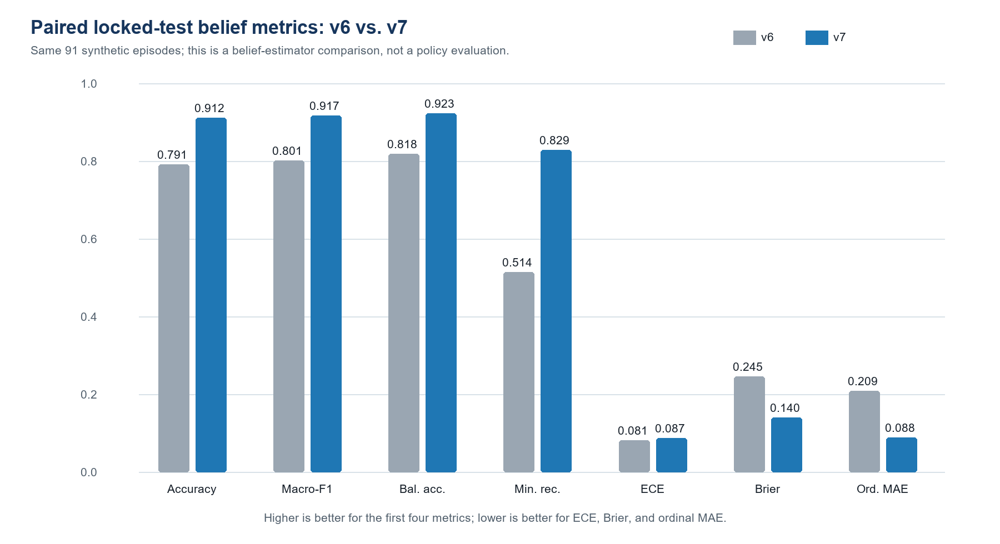
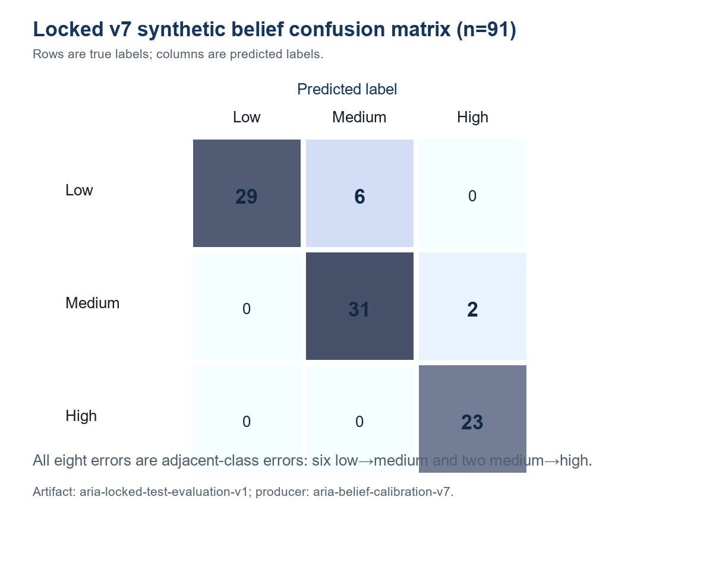

# ARIA: An Auditable Offline Reinforcement-Learning Architecture for Adaptive Mock Interviews

**Raghav Sejpal (23BAI0095), Krissh Verma (23BAI0098)**  
**Supervisor:** Dhivyaa C R  
**Project:** BCSE497J, ARIA — Autonomous Reinforcement-Based Interview Agent

## Abstract

Adaptive mock-interview systems must do more than generate plausible questions: they must maintain an interpretable estimate of candidate evidence, select actions without extrapolating beyond logged behavior, and state which claims their evaluation can support. This paper presents an evidence-bounded reconstruction of ARIA, an Autonomous Reinforcement-Based Interview Agent whose audited offline implementation combines a calibrated belief representation with Implicit Q-Learning (IQL). The current contract uses a 33-dimensional `aria-state-v4` state and eight interview actions. A production synthetic corpus contains 600 episodes and 9,018 transitions, partitioned by 33 identity components into 422 training, 87 validation, and 91 locked-test episodes. On the locked synthetic test, the belief-v3 configuration achieved 0.9121 accuracy, 0.9168 macro-F1, 0.9227 balanced accuracy, 0.0870 expected calibration error, and 0.1395 Brier score. A paired v6–v7 diagnostic improved accuracy by 0.1209 and macro-F1 by 0.1158; identity-component bootstrap intervals were positive for both measures. These are belief-estimation results, not learned-policy outcomes. A separate clipped weighted-importance-sampling diagnostic on 1,405 validation transitions estimated reward 0.4618 with effective sample size 1003.5, but its release gate is false. The live application currently injects fixed evidence values and cycles through three actions; it does not load the frozen IQL checkpoint. In light of 2026 work on multimodal mock interviews, trait-activated interview data, psychometric fairness, and disability exclusion, ARIA is positioned as an auditable experimental substrate rather than a validated hiring instrument. Human construct validity, accessibility, subgroup fairness, live integration, and fresh learned-policy rollouts remain required.

**Keywords:** adaptive interviewing; automated video interview; calibration; Implicit Q-Learning; multimodal assessment; offline reinforcement learning; auditability; synthetic data

## I. Introduction

Automated interviews increasingly combine language, speech, and visual behavior. Earlier work showed that multimodal cues can predict interviewer ratings [5]–[7], [25], [46], [51], [55], [62], [67]. Psychometric studies subsequently asked harder questions about reliability, generalizability, ground-truth quality, and whether model scores correspond to intended constructs [2], [4], [24], [32], [37], [41], [45]. This progression matters: a predictive model can reproduce a rating without establishing that the rating is job-relevant, stable, fair, or useful for deciding what to ask next.

Adaptation introduces a sequential decision problem. The interviewer observes incomplete evidence, updates a belief over skills, and chooses a next action. Computerized adaptive testing provides a precedent for uncertainty-aware item selection [22], while offline reinforcement learning provides tools for learning from logged trajectories when online exploration would be inappropriate [8], [17]–[19]. Yet neither adaptation nor offline learning automatically establishes beneficial policy behavior. Evaluation must separate state estimation from action selection and must make behavior-policy mismatch visible.

The governance burden is especially high in hiring. Research has documented unsupported vendor claims, instability, demographic disparities, disability exclusion, contested emotion inference, and opacity in audit regimes [1], [3], [9]–[16], [26]–[31], [34]–[36], [38], [42], [43], [47]–[49], [53], [56]–[61], [63]. These concerns are not peripheral ethical add-ons. They affect the validity of observations, the accessibility of the procedure, and the meaning of any score.

Recent 2026 literature sharpens the problem. PolyInterview demonstrates role-conditioned planning, answer-aware follow-ups, and multimodal feedback at platform scale, while also reporting weaker faithfulness when generating polished responses [21]. Two CHI studies show that digitized assessments and AI interviews can impose access labor, normative behavioral expectations, information asymmetry, and privacy burdens on disabled applicants [26], [27]. A psychometric synthesis maps machine-learning fairness criteria to long-standing testing concepts and emphasizes bias propagation through sequential assessment decisions [54]. A systematized review describes a shift from matching models toward recruiting agents [68], and a CSCW study finds that applicants increasingly expect interactive, controllable AI interview experiences [69]. AVI-Personality supplies trait-activated prompts, expert behaviorally anchored ratings, and a large multimodal dataset, but its multimodal gains over strong text baselines are modest [70]. Accordingly, ARIA cannot claim novelty merely from combining multimodality, generated questions, or adaptive interaction.

This study asks: (RQ1) What state, action, belief, data, and policy contracts are implemented and traceable in the current repository? (RQ2) What do the frozen synthetic artifacts establish about belief estimation and offline policy diagnostics? (RQ3) Which claims remain unsupported because learned-policy rollouts, live integration, and human validation are incomplete?

The contribution is fourfold. First, we reconstruct a versioned 33-dimensional belief-aware interview contract and eight-action policy interface. Second, we verify an identity-isolated synthetic trajectory corpus and a locked belief evaluation with calibration and class-sensitive metrics. Third, we trace an IQL checkpoint and a diagnostic off-policy estimate while preserving the distinction between value estimation and policy effectiveness. Fourth, we expose the evidence boundary between the implemented offline pipeline, the simplified live application, and the studies still required for validity, fairness, accessibility, and deployment. This scope follows the broad, engineering-forward presentation common in relevant IEEE Access work [58], [65], [66], but deliberately narrows claims to the audited artifacts.

## II. Related Work / Literature Review

### A. Structured and Automated Interviews

Structured interviews have stronger foundations than unstructured impressions, but validity depends on question design, scoring, and criterion evidence [23], [39]. Computational interview research initially inferred hirability or performance from verbal and nonverbal behavior [7], [46], [51], [67]. HireNet and later hierarchical attention models represented frames, words, answers, and interviews at multiple levels [5], [25]. Other systems predicted communication skill or personality from asynchronous video [62], [66]. These studies established technical feasibility, not interchangeability between behavioral cues and occupational competence.

Recent psychometric work makes that distinction explicit. Automated personality and competency scores require reliability, convergent or criterion validity, and generalizability checks [2], [4]. Performance depends on training-sample size, label reliability, and language model choice [37], while automated speech recognition error can propagate into interview scores [10]. Koutsoumpis et al. examine personality and interview performance jointly [32], and Hickman et al. test cognitive ability scoring, behavioral modes, and bias [24]. Faking, impression management, and candidates' use of AI further complicate score interpretation [50]. ARIA therefore treats its low/medium/high labels as synthetic engineering targets, not validated occupational constructs.

### B. Multimodal Fusion and IEEE Access Comparators

Multimodal systems combine lexical, acoustic, and visual streams, but more modalities do not guarantee better measurement. Booth et al. found that verbal features were competitive with a combined model and that visual information could worsen fairness indicators [6]. Window-consistency fusion [55], Doc2Vec fusion [67], and multimodal attention [25] offer increasingly elaborate representations, while uncertainty-aware spoken-language assessment shows why predictive confidence should be modeled rather than ignored [64].

Three IEEE Access papers are direct structural and technical comparators. Suen et al. presented an end-to-end TensorFlow personality-recognition pipeline from asynchronous video [66]. Kim et al. introduced fairness-aware multimodal learning using distributional regularization and continuous-score fairness measures [58]. Putra et al. proposed MAG-BERT-ARL, reporting performance and fairness trade-offs without requiring sensitive attributes at inference [65]. Together, these papers motivate ARIA's modular description, explicit metrics, and comparative tables. They also caution against a single aggregate accuracy claim: Kim et al. require group labels during training, whereas Putra et al. avoid them but report inconsistent behavior across fairness criteria [58], [65]. ARIA has not yet conducted either form of subgroup evaluation.

The 2026 AVI-Personality dataset further shows that targeted questions designed under Trait Activation Theory can strengthen self–other agreement and that trained raters using behaviorally anchored scales provide a more defensible label source than crowd impressions [70]. Its strongest multimodal benchmark only modestly exceeds strong text baselines. This supports a modality-ablation requirement for ARIA rather than an assumption that webcam and prosody features add valid information.

### C. Adaptive Questioning, Item Generation, and Offline RL

Question adaptation has roots in computerized adaptive testing. Deep CAT combines multidimensional latent-state estimation with non-myopic selection [22]. Skill-oriented generation and recommendation can connect job descriptions to interview questions [33], while generative-AI item-development studies demonstrate the need for human review of generated items [44]. PolyInterview adds role-conditioned plans and answer-aware probing [21]. These approaches make broad novelty claims about adaptive questioning untenable; ARIA's distinction is the inspectable state/action and artifact lineage around a conservative offline learner.

IQL learns value by expectile regression and extracts a policy through advantage-weighted behavioral cloning, reducing explicit evaluation of unsupported actions [8]. Nonetheless, offline RL remains vulnerable to distribution shift and optimistic evaluation. High-confidence OPE separates point estimates from reliable bounds [17]; empirical OPE comparisons show sensitivity to horizon, mismatch, and model error [18]; and empirical RL guidance emphasizes protocols, seeds, uncertainty, and held-out evaluation [19]. ARIA consequently uses weighted importance sampling only as a diagnostic and requires fresh rollouts before claiming policy improvement.

### D. Fairness, Accessibility, Privacy, and Applicant Experience

Algorithmic-hiring reviews identify recurring gaps between vendor claims, validation practice, and governance [1], [3], [16], [34], [43], [57], [68]. External stability audits reveal sensitivity to irrelevant résumé changes [9]. Audit frameworks and field studies show that access, documentation, independence, and institutional incentives constrain what audits can establish [29], [31], [48], [49], [60], [63]. The literature therefore supports system-level evidence ledgers, not one-time parity reports.

Applicant reactions are equally consequential. Algorithmic evaluation can reduce perceived justice and acceptance, particularly in high-stakes settings [13], [14], [15], [40], [52], [59]. Emotion-AI studies raise concerns about autonomy, emotional labor, identity, workplace surveillance, and privacy [38], [42], [61]. Recruiter studies show that operational practice may depart from formal model descriptions [47]. Human-rights and contextual accounts argue for impact assessment and contestability rather than a purely technical definition of fairness [30], [34], [35], [36], [43], [56].

Disability scholarship shows why aggregate demographic metrics are insufficient. Technical and legal analyses identify accommodation and proxy-discrimination risks [11], [28], [53]. Modified question wording can affect autistic and neurotypical responses differently [12]. In 2026, Luria et al. found that 9 of 17 disabled participants could not complete at least one simulated digitized assessment, while Kameswaran et al. documented normative scoring expectations, loss of interview mutuality, and privacy concerns across 19 disabled job seekers [26], [27]. These studies motivate accessible alternatives, candidate control, human review, and an explicit prohibition on using ARIA as an autonomous screening tool.

### E. Research Gap

The literature contains strong work on structured interviewing, multimodal scoring, adaptive item selection, offline RL, and algorithmic-hiring governance. What remains comparatively underdeveloped is an artifact-level account that connects: (i) a versioned interview belief state; (ii) identity-safe trajectory construction; (iii) calibrated belief evaluation; (iv) a conservative offline policy checkpoint; (v) OPE limitations; and (vi) the actual live execution path. Recruiting-agent reviews call for more integrated evaluation and governance [68], and 2026 user studies demand interactivity without sacrificing agency or access [26], [27], [69]. ARIA addresses the narrower engineering gap of traceable separation—not the broader scientific gap of real-world interview validity.

| Work | Data and modality | Adaptation | Evaluation emphasis | Boundary relevant to ARIA |
|---|---|---|---|---|
| PolyInterview (2026) [21] | 1,564 sessions; text, audio, video | Answer-aware follow-ups | Expert quality ratings | No criterion-validity or employment-outcome evidence |
| Luria et al. (2026) [26] | 17 disabled participants; simulated assessments | None | Qualitative access and exclusion | Assessment completion can itself be inequitable |
| Kameswaran et al. (2026) [27] | 19 disabled job seekers | User-requested responsiveness | Qualitative surveillance and autonomy | AI interviews can remove mutuality and disclosure control |
| Cheng (2026) [54] | Conceptual psychometric/ML synthesis | Sequential testing workflow | Fairness definitions and bias propagation | Fairness must be tested across the full pipeline |
| AVI-Personality (2026) [70] | 646 participants; 3,876 videos | Trait-activated prompts | Reliability, validity, fairness, MSE | Grounded labels and modality ablations are essential |
| ARIA (this work) | 600 synthetic episodes; 9,018 transitions | Offline IQL over eight actions | Calibration, lineage, diagnostic OPE | No human validity or policy-effectiveness claim |

## III. Proposed Model / Methodology

### A. Evidence-Authority Protocol

The methodology begins with an authority hierarchy: immutable experimental artifacts with provenance and hashes; executable code and tests; current architecture and runbooks; Git history; current reports; older summaries; and aspirational specifications. Conflicts were resolved rather than averaged. This rule corrected stale descriptions of a 32-dimensional state, belief-v2, and a 53-episode result near 96%. The current paper uses the 33-dimensional state and the 91-episode v7 locked evaluation.

The audit covered tracked and untracked files, Git history, source and tests, Markdown, two Word reports, 33 PDFs, CSV/XLSX evidence, JSON/YAML artifacts, checkpoints, images, and frontend/backend code. Large data files were checked across all records for schema, missingness, action support, identity overlap, provenance, and hashes. This evidence-ledger approach is aligned with calls for external stability testing and multi-layer audit ecosystems [9], [29], [48], [49], [60], [63].

### B. ARIA Architecture and Implementation Boundary

The intended architecture ingests résumé and job-description context, constructs a skill ontology, processes response evidence, updates skill beliefs, and selects a next question. The evaluated offline pipeline is concentrated in Module 7. The current React/Vite and FastAPI/WebSocket application is materially simpler: it accepts transcripts, exposes webcam/audio interactions, assigns fixed semantic and behavioral scores of 0.9 with low cognitive load, and cycles through foundation probing, increasing difficulty, and switching topics. It neither loads the frozen IQL checkpoint nor executes the complete vision, prosody, fusion, fairness, and policy stack.

The architecture is intentionally described in layers, following the transparent system presentation used in IEEE Access comparators [58], [65], [66]. However, design lessons from 2026 papers are labeled as future protocol requirements. PolyInterview's faithfulness failure motivates transcript-grounded feedback checks [21]; Cheng's bias-propagation analysis motivates fairness gates at data, belief, action, and outcome stages [54]; Sakib et al.'s findings motivate response editing, control, and transparent feedback options [69]; and AVI-Personality motivates trait-activated prompts and behaviorally anchored human labels [70]. None is represented as a completed ARIA feature.

### C. State, Belief, and Actions

The `aria-state-v4` vector has 33 dimensions: skill beliefs, uncertainty and entropy, coverage, difficulty, recent evidence, modality availability, temporal features, and session context. Eight discrete actions encode increasing or decreasing difficulty, continuing or switching topic, probing foundations, asking behavioral or situational questions, and concluding. Bounds and dimensions are checked during replay reconstruction and inference. The explicit contract supports auditability because each policy input and permissible action can be traced.

Let the belief over skill level at turn t be b_t and the evidence observation be o_t. The update is implemented as b_(t+1)=U(b_t,o_t;c), where c identifies the versioned calibration configuration. The policy receives s_t=phi(b_t,u_t,h_t,m_t), combining belief, uncertainty u_t, interview history h_t, and modality/context flags m_t. Calibration is evaluated independently of policy action quality, consistent with the distinction between predictive confidence and decision utility [20], [64].

### D. Synthetic Trajectories and Leakage Control

The production corpus contains 600 episodes and 9,018 transitions. It is derived from 60 résumé–job-description pairs expanded through paraphrase and perturbation variants. Leakage control operates on connected identity components rather than row identity. Thirty-three components are assigned wholly to train, validation, or test, producing 422/87/91 episodes and zero cross-split component overlap. Labels are balanced at 200 low, 200 medium, and 200 high episodes. All eight actions occur in the corpus.

Synthetic data permits controlled engineering tests but does not reproduce real applicant distributions, disability access needs, strategic behavior, or employment criteria. The 2026 disability studies [26], [27] and multidisciplinary reviews [34], [57], [68] make this limitation substantive: identity-safe splitting prevents one form of leakage, not population or construct invalidity.

| Dataset property | Audited value | Verification basis |
|---|---:|---|
| Episodes | 600 | Complete corpus parse |
| Transitions | 9,018 | Complete transition count |
| Identity components | 33 | Connected-component manifest |
| Train / validation / locked test | 422 / 87 / 91 | Split manifest |
| Synthetic labels | 200 / 200 / 200 | Full label distribution |
| Action support | 8 of 8 | Full action histogram |
| Cross-split component overlap | 0 | Component-isolation audit |

### E. Belief Calibration and Locked Evaluation

The frozen locked-test artifact is `aria-locked-test-evaluation-v1`, produced by `aria-belief-calibration-v7`. It evaluates 91 test episodes across six identity components and explicitly records `evaluates_learned_policy: false`. Metrics include accuracy/micro-F1, macro-F1, balanced accuracy, per-class precision/recall/F1, minimum recall, ordinal MAE, expected calibration error (ECE), Brier score, coverage, abstention, and prediction concentration. The confusion matrix uses true classes as rows and predicted classes as columns.

### F. IQL Training and Offline Policy Diagnostic

The frozen checkpoint uses discount 0.99, target-update coefficient 0.005, expectile 0.8, inverse-temperature beta 3.0, learning rate 0.0001, seed 42, patience 10, and best epoch 4. Checkpoint metadata records `aria-state-v4`, `belief-v3`, the split-manifest hash, artifact commit, and SHA-256. The validation objective 4.13864 is a training-selection statistic, not an estimate of interview benefit.

IQL was selected because it limits explicit maximization over unsupported actions [8]. Policy evaluation nevertheless depends on overlap with the behavior policy. The repository's clipped weighted-importance-sampling diagnostic uses 1,405 validation transitions, clip threshold 20, and reports estimate 0.4618, effective sample size 1003.5, maximum ratio 5.464, and zero clipped ratios. In accordance with OPE guidance [17]–[19], the release gate remains false and fresh fixed-cycle, random-valid-action, uncertainty-greedy, and IQL rollouts are required.

### G. Verification Protocol

The experimental verification combined schema checks, hash reconciliation, complete data validation, checkpoint inspection, focused tests, and frontend build verification. The focused Module 7/calibration suite produced 341 passing tests. The frontend build passed. An unscoped repository pytest invocation did not collect cleanly because vendor/temp tests, a stale root test, and optional dependencies are present; this is reported as an environment/repository limitation rather than converted into a success claim.

## IV. Results and Analysis

### A. Locked Belief Results

The locked v7 belief evaluation achieved accuracy and micro-F1 0.9121, macro-F1 0.9168, balanced accuracy 0.9227, minimum class recall 0.8286, ordinal MAE 0.0879, ECE 0.0870, and Brier score 0.1395. Coverage was 1.0 with no abstentions. Class recalls were 0.8286, 0.9394, and 1.0000 for low, medium, and high; corresponding F1 values were 0.9063, 0.8857, and 0.9583.

| Metric | v6 paired baseline | v7 locked result | Difference (v7–v6) |
|---|---:|---:|---:|
| Accuracy / micro-F1 | 0.7912 | 0.9121 | +0.1209 |
| Macro-F1 | 0.8010 | 0.9168 | +0.1158 |
| Balanced accuracy | 0.8179 | 0.9227 | +0.1048 |
| Minimum class recall | 0.5143 | 0.8286 | +0.3143 |
| ECE | 0.0808 | 0.0870 | +0.0062 |
| Brier score | 0.2451 | 0.1395 | −0.1055 |
| Ordinal MAE | 0.2088 | 0.0879 | −0.1209 |

The paired identity-component bootstrap reports a 95% interval of 0.0435–0.2235 for the accuracy difference and 0.0443–0.1976 for the macro-F1 difference. The positive intervals support non-regression on this synthetic locked set. ECE increased by 0.0062, with a bootstrap interval spanning negative and positive values, whereas Brier score improved materially. This mixed calibration picture is why both reliability-sensitive and class-sensitive metrics are retained [20].

### B. Corpus and Policy Diagnostics

The corpus passed the configured schema, distribution, and split-isolation checks. Each action has support, but support alone does not guarantee adequate state–action coverage. The WIS result is numerically stable under its configured clip threshold, as indicated by the effective sample size and absence of clipping. It remains a validation-set diagnostic because estimated propensities, synthetic rewards, and policy mismatch can bias the estimate [17], [18]. No confidence-bound release rule was satisfied, and the artifact itself requires fresh rollout comparison.

| Evidence item | Result | Correct interpretation |
|---|---:|---|
| Focused Module 7/calibration tests | 341 passed | Contract and regression evidence for tested code paths |
| Frontend production build | Passed | Buildability, not end-to-end scientific validity |
| IQL best epoch / validation objective | 4 / 4.13864 | Training trace, not deployment effect |
| Validation WIS estimate | 0.4618 | Diagnostic estimate only |
| WIS ESS / maximum ratio | 1003.5 / 5.464 | Numerically usable sample, not causal identification |
| Release gate | False | Learned-policy effectiveness remains unverified |

### C. Comparison With Existing Approaches

ARIA's locked belief accuracy should not be ranked directly against published interview systems because labels, populations, tasks, and outcomes differ. Naim et al. [7], HireNet [5], and IEEE Access systems [58], [65], [66] predict human judgments or personality-related targets from real videos. PolyInterview evaluates question and feedback quality [21]. AVI-Personality evaluates continuous traits and competencies with expert ratings [70]. ARIA evaluates synthetic categorical beliefs. A numerical leaderboard across these studies would be invalid.

The meaningful comparison is methodological. ARIA offers stronger artifact separation than many end-to-end prototypes: the belief test states that it is not a policy evaluation, the OPE artifact keeps its release gate false, and the live path is disclosed as distinct. Conversely, ARIA is weaker in human evidence. It has no participant study comparable to PolyInterview's expert assessment [21], no psychometric label construction comparable to AVI-Personality [70], no fairness experiment comparable to Kim et al. or Putra et al. [58], [65], and no accessibility study comparable to Luria et al. or Kameswaran et al. [26], [27].

### D. Discussion

The results support a calibrated synthetic belief component and a reproducible offline-learning lineage. They do not establish that adaptive questions improve interviews. This distinction addresses a common evaluation failure: stored-state prediction and sequential policy value are different estimands. The v7 improvement is meaningful within the paired locked artifact, but the test contains only six identity components; component-level intervals should therefore be interpreted as diagnostic rather than population-general confidence intervals.

The 2026 literature also changes the model-development priorities. PolyInterview's low faithfulness rating for polished responses indicates that feedback must remain anchored to the candidate transcript [21]. AVI-Personality suggests that future human data should use construct-targeted prompts and trained behaviorally anchored raters, followed by modality ablations [70]. Cheng's analysis requires fairness evaluation across administration, evidence extraction, belief update, action selection, and final feedback—not only output parity [54]. Sakib et al. show that user control and feedback design affect confidence, expressiveness, and perceived usefulness [69]. These findings justify four release prerequisites: grounded feedback checks, psychometric labeling, pipeline-wide subgroup audits, and candidate control mechanisms.

Accessibility is a decisive limitation. Disability-related communication patterns can be misread as low competence, and inaccessible interfaces can prevent completion before any model prediction occurs [11], [12], [26]–[28], [53]. The live system must therefore provide keyboard and screen-reader compatibility, alternatives to timed audiovisual response, accommodation controls, editing or re-recording without penalty, and human appeal. It should remain a practice and research tool, not an autonomous gatekeeper.

Privacy and contestability are similarly unresolved. Audio/video signals can reveal sensitive attributes, and emotion analysis may produce surveillance and self-presentation harms [15], [36], [38], [42], [52], [61]. Future work must minimize retention, separate raw media from derived features, document consent and deletion, disclose model limits, and permit human review. Auditability cannot be reduced to an internal log; outside access and institutional accountability matter [29], [31], [48], [49], [60], [63].

### E. Threats to Validity and Non-Claims

Construct validity is absent because labels are synthetic. External validity is absent because no real candidate population or job-performance criterion was evaluated. Policy validity is absent because there are no fresh learned-policy rollouts. Fairness validity is absent because demographic, disability, intersectional, and accessibility outcomes were not measured. Integration validity is limited because the live application does not run the evaluated offline stack. Statistical precision is limited by six locked-test identity components, even though the episode count is 91.

Accordingly, this paper does not claim that ARIA identifies competent candidates, improves hiring, is demographically fair, is accessible, outperforms human interviewers, or is production-ready. It also does not interpret contextual behavioral cues as verified competence. The release status `VALIDATED_SYNTHETIC` applies only to the specified synthetic belief artifact.

## V. Conclusion

ARIA's defensible present contribution is an auditable offline architecture for studying adaptive mock interviews. The repository links a 33-dimensional state, eight actions, an identity-isolated 600-episode synthetic corpus, a calibrated 91-episode locked belief evaluation, and a frozen IQL checkpoint with a conservative diagnostic OPE record. The strongest result is the v7 belief performance—0.9121 accuracy, 0.9168 macro-F1, and 0.0870 ECE—together with explicit evidence that these numbers do not evaluate the learned policy.

The next study should execute fresh held-out rollouts against fixed-cycle, random-valid-action, and uncertainty-greedy baselines; report component-level uncertainty; and keep the locked test isolated. A separately governed human study should use construct-targeted questions, trained behaviorally anchored raters, accessible interaction alternatives, modality ablations, subgroup calibration and error analysis, candidate-reaction measures, and human appeal. Until those studies are completed, ARIA should be presented as a transparent research prototype for mock-interview experimentation, not a hiring decision system.

## References

[1] M. Raghavan, S. Barocas, J. Kleinberg, and K. Levy, “Mitigating Bias in Algorithmic Hiring: Evaluating Claims and Practices,” Proceedings of the 2020 Conference on Fairness, Accountability, and Transparency, 2020. doi: 10.1145/3351095.3372828.
[2] L. Hickman, N. Bosch, V. Ng, R. Saef, L. Tay, and S. E. Woo, “Automated Video Interview Personality Assessments: Reliability, Validity, and Generalizability Investigations,” Journal of Applied Psychology, 2022. doi: 10.1037/apl0000695.
[3] N. T. Tippins, F. L. Oswald, and S. McPhail, “Scientific, Legal, and Ethical Concerns About AI-Based Personnel Selection Tools: A Call to Action,” Personnel Assessment and Decisions, 2021. doi: 10.31234/osf.io/6gczw.
[4] J. Liff, N. Mondragon, C. Gardner, C. J. Hartwell, and A. L. Bradshaw, “Psychometric Properties of Automated Video Interview Competency Assessments,” Journal of Applied Psychology, 2024. doi: 10.1037/apl0001173.
[5] L. Hemamou, G. Felhi, V. Vandenbussche, J. C. Martin, and C. Clavel, “HireNet: A Hierarchical Attention Model for the Automatic Analysis of Asynchronous Video Job Interviews,” Proceedings of the AAAI Conference on Artificial Intelligence, 2019. doi: 10.1609/aaai.v33i01.3301573.
[6] B. M. Booth, L. Hickman, S. K. Subburaj, L. Tay, S. E. Woo, and S. K. D'Mello, “Bias and Fairness in Multimodal Machine Learning: A Case Study of Automated Video Interviews,” Proceedings of the 2021 International Conference on Multimodal Interaction, 2021. doi: 10.1145/3462244.3479897.
[7] I. Naim, M. I. Tanveer, D. Gildea, and M. E. Hoque, “Automated Analysis and Prediction of Job Interview Performance,” IEEE Transactions on Affective Computing, 2018. doi: 10.1109/TAFFC.2016.2614299.
[8] I. Kostrikov, A. Nair, and S. Levine, “Offline Reinforcement Learning with Implicit Q-Learning,” arXiv preprint arXiv:2110.06169, 2021. doi: 10.48550/arXiv.2110.06169.
[9] A. K. Rhea, K. Markey, L. D'Arinzo, H. Schellmann, M. Sloane, P. C. Squires, F. A. Khan, and J. Stoyanovich, “An External Stability Audit Framework to Test the Validity of Personality Prediction in AI Hiring,” Data Mining and Knowledge Discovery, 2022. doi: 10.1007/s10618-022-00861-0.
[10] L. Hickman, M. Langer, R. Saef, and L. Tay, “Automated Speech Recognition Bias in Personnel Selection: The Case of Automatically Scored Job Interviews,” Journal of Applied Psychology, 2025. doi: 10.1037/apl0001247.
[11] M. Buyl, C. Cociancig, C. Frattone, and N. Roekens, “Tackling Algorithmic Disability Discrimination in the Hiring Process,” Proceedings of the 2022 ACM Conference on Fairness, Accountability, and Transparency, 2022. doi: 10.1145/3531146.3533169.
[12] A. L. Benson, K. L. Colley, J. J. Prasad, C. Willis, and T. Powell-Rudy, “Comparing Autistic and Neurotypical Responses to Conventional and Modified Questions in Algorithmically Scored Asynchronous Video Interviews,” International Journal of Selection and Assessment, 2024. doi: 10.1111/ijsa.12512.
[13] Y. Ackgoz, H. K. Davison, M. Compagnone, and M. M. Laske, “Justice Perceptions of Artificial Intelligence in Selection,” International Journal of Selection and Assessment, 2020. doi: 10.1111/ijsa.12306.
[14] J. K. Oostrom, D. Holtrop, A. Koutsoumpis, W. van Breda, S. Ghassemi, and R. E. de Vries, “Applicant Reactions to Algorithm- versus Recruiter-based Evaluations of an Asynchronous Video Interview and a Personality Inventory,” Journal of Occupational and Organizational Psychology, 2023. doi: 10.1111/joop.12465.
[15] C. Pyle, K. Roemmich, and N. Andalibi, “U.S. Job-Seekers' Organizational Justice Perceptions of Emotion AI-Enabled Interviews,” Proceedings of the ACM on Human-Computer Interaction, 2024. doi: 10.1145/3686993.
[16] A. Fabris, N. Baranowska, M. Dennis, D. Graus, P. Hacker, J. Saldivar, F. Zuiderveen Borgesius, and A. J. Biega, “Fairness and Bias in Algorithmic Hiring: A Multidisciplinary Survey,” ACM Transactions on Intelligent Systems and Technology, 2025. doi: 10.1145/3696457.
[17] P. S. Thomas, G. Theocharous, and M. Ghavamzadeh, “High-Confidence Off-Policy Evaluation,” Proceedings of the AAAI Conference on Artificial Intelligence, 2015. doi: 10.1609/aaai.v29i1.9541.
[18] C. Voloshin, H. Le, N. Jiang, and Y. Yue, “Empirical Study of Off-Policy Policy Evaluation for Reinforcement Learning,” arXiv preprint arXiv:1911.06854, 2019. doi: 10.48550/arXiv.1911.06854.
[19] A. D. Patterson, S. Neumann, M. White, and A. White, “Empirical Design in Reinforcement Learning,” arXiv preprint arXiv:2304.01315, 2023. doi: 10.48550/arXiv.2304.01315.
[20] C. Guo, G. Pleiss, Y. Sun, and K. Q. Weinberger, “On Calibration of Modern Neural Networks,” Proceedings of Machine Learning Research, 2017. [Online]. Available: https://proceedings.mlr.press/v70/guo17a.html
[21] Z. Wen, J. Cao, K. Chan, Z. Wang, C. Chen, X. Liu, J. Yin, and Z. Li, “PolyInterview: An LLM-based Platform for Immersive Mock Interview Practice with Comprehensive Multimodal Assessment,” arXiv preprint arXiv:2607.10310, 2026. arXiv:2607.10310.
[22] J. Li, R. Gibbons, and V. Rockova, “Deep Computerized Adaptive Testing,” arXiv preprint arXiv:2502.19275, 2026. arXiv:2502.19275.
[23] J. Levashina, C. J. Hartwell, F. P. Morgeson, and M. A. Campion, “The Structured Employment Interview: Narrative and Quantitative Review of the Research Literature,” Personnel Psychology, 2014. doi: 10.1111/peps.12052.
[24] L. Hickman, L. Tay, and S. E. Woo, “Are Automated Video Interviews Smart Enough? Behavioral Modes, Reliability, Validity, and Bias of Machine Learning Cognitive Ability Assessments.,” Journal of Applied Psychology, 2025. doi: 10.1037/apl0001236.
[25] L. Hemamou, A. Guillon, J. Martin, and C. Clavel, “Multimodal Hierarchical Attention Neural Network: Looking for Candidates Behaviour Which Impact Recruiter's Decision,” Ieee Transactions on Affective Computing, 2023. doi: 10.1109/taffc.2021.3113159.
[26] M. Luria, A. Aboulafia, and D. Thakur, “Disqualified by Disability: The Exclusion of Disabled Workers by Digitized Hiring Assessments,” Proceedings of the 2026 CHI Conference on Human Factors in Computing Systems, 2026. doi: 10.1145/3772318.3791485.
[27] V. Kameswaran, V. Hong, J. Clark, Y. Hou, H. Daume III, and K. Shilton, “Surveilling Suitability: How AI Hiring Interviews Impact Job Seekers With Disabilities,” Proceedings of the 2026 CHI Conference on Human Factors in Computing Systems, 2026. doi: 10.1145/3772318.3791516.
[28] N. Tilmes, “Disability, Fairness, and Algorithmic Bias in AI Recruitment,” Ethics and Information Technology, 2022. doi: 10.1007/s10676-022-09633-2.
[29] E. Kazim, A. Koshiyama, A. Hilliard, and R. Polle, “Systematizing Audit in Algorithmic Recruitment,” Journal of Intelligence, 2021. doi: 10.3390/jintelligence9030046.
[30] J. SanchezMonedero, L. Dencik, and L. Edwards, “What Does It Mean to 'Solve' the Problem of Discrimination in Hiring?,” Proceedings of the 2020 Conference on Fairness, Accountability, and Transparency, 2020. doi: 10.1145/3351095.3372849.
[31] C. Wilson, A. Ghosh, S. Jiang, A. Mislove, L. Baker, J. Szary, K. Trindel, and F. Polli, “Building and Auditing Fair Algorithms,” Proceedings of the 2021 ACM Conference on Fairness, Accountability, and Transparency, 2021. doi: 10.1145/3442188.3445928.
[32] A. Koutsoumpis, S. Ghassemi, J. K. Oostrom, D. Holtrop, W. van Breda, T. Zhang, and R. E. de Vries, “Beyond Traditional Interviews: Psychometric Analysis of Asynchronous Video Interviews for Personality and Interview Performance Evaluation Using Machine Learning,” Computers in Human Behavior, 2024. doi: 10.1016/j.chb.2023.108128.
[33] C. Qin, H. Zhu, D. Shen, Y. Sun, K. Yao, P. Wang, and H. Xiong, “Automatic Skill-Oriented Question Generation and Recommendation for Intelligent Job Interviews,” Acm Transactions on Information Systems, 2023. doi: 10.1145/3604552.
[34] A. L. Hunkenschroer, and C. Luetge, “Ethics of AI-Enabled Recruiting and Selection: A Review and Research Agenda,” Journal of Business Ethics, 2022. doi: 10.1007/s10551-022-05049-6.
[35] M. Sloane, E. Moss, and R. Chowdhury, “A Silicon Valley Love Triangle: Hiring Algorithms, Pseudo-Science, and the Quest for Auditability,” Patterns, 2022. doi: 10.1016/j.patter.2021.100425.
[36] E. Aizenberg, M. Dennis, and J. van den Hoven, “Examining the Assumptions of AI Hiring Assessments and Their Impact on Job Seekers Autonomy Over Self-Representation,” Ai \& Society, 2023. doi: 10.1007/s00146-023-01783-1.
[37] L. Hickman, J. Liff, C. Rottman, and C. Calderwood, “The Effects of the Training Sample Size, Ground Truth Reliability, and NLP Method on Language-Based Automatic Interview Scores Psychometric Properties,” Organizational Research Methods, 2024. doi: 10.1177/10944281241264027.
[38] A. S. Ingber, and N. Andalibi, “Emotion AI in Job Interviews: Injustice, Emotional Labor, Identity, and Privacy,” Proceedings of the 2025 ACM Conference on Fairness, Accountability, and Transparency, 2025. doi: 10.1145/3715275.3732002.
[39] M. A. McDaniel, D. L. Whetzel, F. L. Schmidt, and S. D. Maurer, “The Validity of Employment Interviews: A Comprehensive Review and Meta-Analysis.,” Journal of Applied Psychology, 1994. doi: 10.1037/0021-9010.79.4.599.
[40] M. Langer, C. J. Konig, and M. Papathanasiou, “Highly automated Job Interviews: Acceptance Under the Influence of Stakes,” International Journal of Selection and Assessment, 2019. doi: 10.1111/ijsa.12246.
[41] L. Hickman, R. Saef, V. Ng, S. E. Woo, L. Tay, and N. Bosch, “Developing and Evaluating Languagebased Machine Learning Algorithms for Inferring Applicant Personality in Video Interviews,” Human Resource Management Journal, 2021. doi: 10.1111/1748-8583.12356.
[42] K. Roemmich, T. I. Rosenberg, S. Fan, and N. Andalibi, “Values in Emotion Artificial Intelligence Hiring Services: Technosolutions to Organizational Problems,” Proceedings of the Acm on Human-Computer Interaction, 2023. doi: 10.1145/3579543.
[43] S. Kassir, L. Baker, J. Dolphin, and F. Polli, “AI for Hiring in Context: A Perspective on Overcoming the Unique Challenges of Employment Research to Mitigate Disparate Impact,” Ai and Ethics, 2022. doi: 10.1007/s43681-022-00208-x.
[44] D. Segall, and T. Kantrowitz, “Harnessing Generative AI for Assessment Item Development: Comparing AIGenerated and HumanAuthored Items,” International Journal of Selection and Assessment, 2025. doi: 10.1111/ijsa.70021.
[45] T. Zhang, T. Qi, A. Koutsoumpis, Y. Zong, W. Zheng, J. K. Oostrom, D. Holtrop, Z. Luo, and R. E. de Vries, “Assessing Personality Traits and Interview Performance From Asynchronous Video Interviews,” Proceedings of the 33rd ACM International Conference on Multimedia, 2025. doi: 10.1145/3746027.3762016.
[46] L. S. Nguyen, D. Frauendorfer, M. S. Mast, and D. Gatica-Perez, “Hire Me: Computational Inference of Hirability in Employment Interviews Based on Nonverbal Behavior,” Ieee Transactions on Multimedia, 2014. doi: 10.1109/tmm.2014.2307169.
[47] L. Li, T. Lassiter, J. Oh, and M. K. Lee, “Algorithmic Hiring in Practice,” Proceedings of the 2021 AAAI/ACM Conference on AI, Ethics, and Society, 2021. doi: 10.1145/3461702.3462531.
[48] H. Mihaljevic, I. Muller, K. Dill, A. Yollu-Tok, and M. von Grafenstein, “More or Less Discrimination? Practical Feasibility of Fairness Auditing of Technologies for Personnel Selection,” Ai \& Society, 2023. doi: 10.1007/s00146-023-01726-w.
[49] M. Gerchick, R. Encarnacion, C. Tanigawa-Lau, L. Armstrong, A. B. Gutierrez, and D. Metaxa, “Auditing the Audits: Lessons for Algorithmic Accountability From Local Law 144's Bias Audits,” Proceedings of the 2025 ACM Conference on Fairness, Accountability, and Transparency, 2025. doi: 10.1145/3715275.3732004.
[50] L. Hickman, J. Liff, C. Willis, and E. H. Kim, “Can Interviewees Fake Out AI? Comparing the Susceptibility and Mechanisms of Faking Across SelfReports, Human Interview Ratings, and AI Interview Ratings,” International Journal of Selection and Assessment, 2025. doi: 10.1111/ijsa.70014.
[51] L. Chen, M. P. MartinRaugh, C. W. Leong, C. Kitchen, S. Yoon, B. Lehman, H. J. Kell, and C. Lee, “Automatic Scoring of Monologue Video Interviews Using Multimodal Cues,” Proceedings of Interspeech 2016, 2016. doi: 10.21437/interspeech.2016-1453.
[52] B. Liu, L. Wei, M. Wu, and T. Luo, “Speech Production Under Uncertainty: How Do Job Applicants Experience and Communicate With an AI Interviewer?,” Journal of Computer-Mediated Communication, 2023. doi: 10.1093/jcmc/zmad028.
[53] S. L. Fisher, S. Bonaccio, and C. E. Connelly, “AI-based Tools in Selection: Considering the Impact on Applicants With Disabilities,” Organizational Dynamics, 2024. doi: 10.1016/j.orgdyn.2024.101036.
[54] Y. Cheng, “Fairness Issues and Evaluation in Psychometrics and AI/ML: What Can We Learn From Each Field?,” Psychometrika, 2026. doi: 10.1017/psy.2026.10110.
[55] J. Lv, C. Chen, and Z. Liang, “Automated Scoring of Asynchronous Interview Videos Based on Multi-Modal Window-Consistency Fusion,” Ieee Transactions on Affective Computing, 2024. doi: 10.1109/taffc.2023.3294335.
[56] J. Yam, and J. A. Skorburg, “From Human Resources to Human Rights: Impact Assessments for Hiring Algorithms,” Ethics and Information Technology, 2021. doi: 10.1007/s10676-021-09599-7.
[57] K. D. Hughes, A. Konnikov, N. Denier, and Y. Hu, “Problematizing the Role of Artificial Intelligence in Hiring and Organizational Inequalities: A Multidisciplinary Review,” Human Relations, 2025. doi: 10.1177/00187267251403902.
[58] C. Kim, J. Choi, J. Yoon, D. Yoo, and W. Lee, “Fairness-Aware Multimodal Learning in Automatic Video Interview Assessment,” Ieee Access, 2023. doi: 10.1109/access.2023.3325891.
[59] A. Hilliard, N. Guenole, and F. Leutner, “Robots Are Judging Me: Perceived Fairness of Algorithmic Recruitment Tools,” Frontiers in Psychology, 2022. doi: 10.3389/fpsyg.2022.940456.
[60] S. Costanza-Chock, I. D. Raji, and J. Buolamwini, “Who Audits the Auditors? Recommendations From a Field Scan of the Algorithmic Auditing Ecosystem,” Proceedings of the 2022 ACM Conference on Fairness, Accountability, and Transparency, 2022. doi: 10.1145/3531146.3533213.
[61] K. Roemmich, F. Schaub, and N. Andalibi, “Emotion AI at Work: Implications for Workplace Surveillance, Emotional Labor, and Emotional Privacy,” Proceedings of the 2023 CHI Conference on Human Factors in Computing Systems, 2023. doi: 10.1145/3544548.3580950.
[62] H. Y. Suen, K. E. Hung, and C. Lin, “Intelligent Video Interview Agent Used to Predict Communication Skill and Perceived Personality Traits,” Human-Centric Computing and Information Sciences, 2020. doi: 10.1186/s13673-020-0208-3.
[63] I. D. Raji, P. Xu, C. Honigsberg, and D. E. Ho, “Outsider Oversight: Designing a Third Party Audit Ecosystem for AI Governance,” Proceedings of the 2022 AAAI/ACM Conference on AI, Ethics, and Society, 2022. doi: 10.1145/3514094.3534181.
[64] A. Malinin, A. Ragni, K. Knill, and M. Gales, “Incorporating Uncertainty Into Deep Learning for Spoken Language Assessment,” Proceedings of the 55th Annual Meeting of the Association for Computational Linguistics: Student Research Workshop, 2017. doi: 10.18653/v1/p17-2008.
[65] B. Putra, K. Azizah, C. Olivia Mawalim, I. Akmal Hanif, S. Sakti, C. Wee Leong, and S. Okada, “MAG-BERT-ARL for Fair Automated Video Interview Assessment,” Ieee Access, 2024. doi: 10.1109/access.2024.3473314.
[66] H. Y. Suen, K. E. Hung, and C. Lin, “TensorFlow-Based Automatic Personality Recognition Used in Asynchronous Video Interviews,” Ieee Access, 2019. doi: 10.1109/access.2019.2902863.
[67] L. Chen, G. Feng, C. W. Leong, B. Lehman, M. P. MartinRaugh, H. J. Kell, C. Lee, and S. Yoon, “Automated Scoring of Interview Videos Using Doc2Vec Multimodal Feature Extraction Paradigm,” Proceedings of the 18th ACM International Conference on Multimodal Interaction, 2016. doi: 10.1145/2993148.2993203.
[68] Z. Zhao, and G. Wei, “From Matching Models to Recruiting Agents: A Systematized Narrative Review of AI Recruitment Systems, Evaluation, and Governance,” arXiv preprint arXiv:2609.04286, 2026. arXiv:2609.04286.
[69] M. N. Sakib, N. M. Rayasam, and S. Dey, “Expecting Too Much, Getting Too Little: Exploring the Challenges and Design Opportunities of Asynchronous AI Interviewers,” arXiv preprint arXiv:2601.02775, 2026. arXiv:2601.02775.
[70] T. Zhang, J. Shang, A. Koutsoumpis, Y. Zong, R. E. de Vries, and W. Zheng, “AVI-Personality: A Trait-Activated Multimodal Dataset for Personality and Competency Assessment in Asynchronous Video Interviews,” arXiv preprint arXiv:2608.25316, 2026. arXiv:2608.25316.
